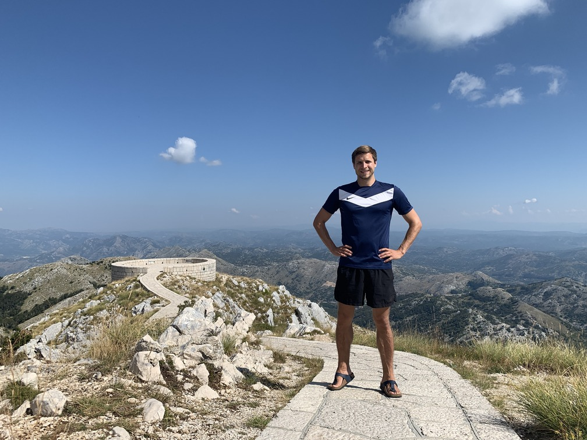
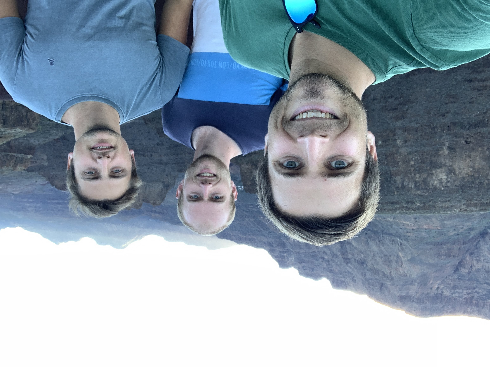

--- 
title: A Picture of Every Country I've Visited
tags: [Instructions]
style: fill
color: success
description: I've been to 75 countries. 
---

## 2022

### 75. Luxembourg

### 74. Liechtenstein

### 73. Jordan

## 2021

### 72. Argentina

### 71. Brazil

### 70. Georgia

### 69. Romania

### 68. Bulgaria

### 67. Mauritius

## 2020

### 66. Montenegro

### 65. North Ireland

### 64. St Vincent

### 63. St. Lucia

### 62. Martinique

### 61. Lebanon

### 60. Serbia

## 2019

### 59. Cyprus

### 58. Malta

### 57. New_Zealand

## 2018

### 56. Australia

### 55. United Arab Emirates

### 54. Egypt

### 53. Morocco

### 52. Vatican

### 51. Bosnia

### 50. Greece

### 49. Albania

### 48. Macedonia

### 47. Latvia

### 46. Lithuania

### 45. Finland

### 44. Estonia

### 43. Slovakia

### 42. Colombia

### 41. Bolivia

## 2017

### 40. Peru

### 39. Panama

### 38. Iceland

### 37. Wales

### 36. Sri Lanka

### 35. Qatar

## 2016

### 34. Ireland

### 33. Mexico

### 32. Denmark

### 31. Sweden

### 30. Croatia

### 29. Slovenia

### 28. Portugal

## 2015

### 27. Canada

### 26. United States

## 2014

### 25. Turkey

### 24. Czechia

### 23. Japan

### 22. China

### 21. Malaysia

### 20. Cambodia

### 19. Thailand

### 18. Vietnam

### 17. Taiwan

### 16. Philippines

### 15. Macau

### 14. Hong Kong

### 13. Switzerland

### 12. Israel

## 2013

### 11. Poland

## before 2013

### 10. Hungary

### 9. San Marino

### 8. Italy

### 7. Spain

### 6. England

### 5. Netherlands

### 4. Belgium

### 3. France

### 2. Austria

### 1. Germany

