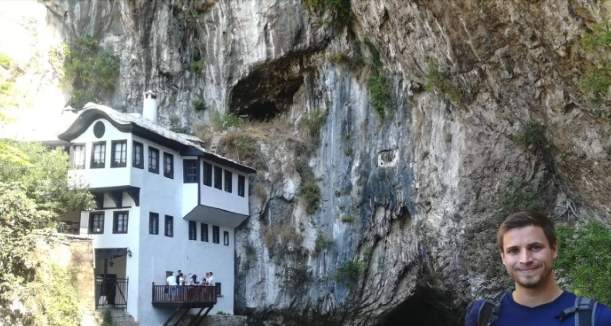
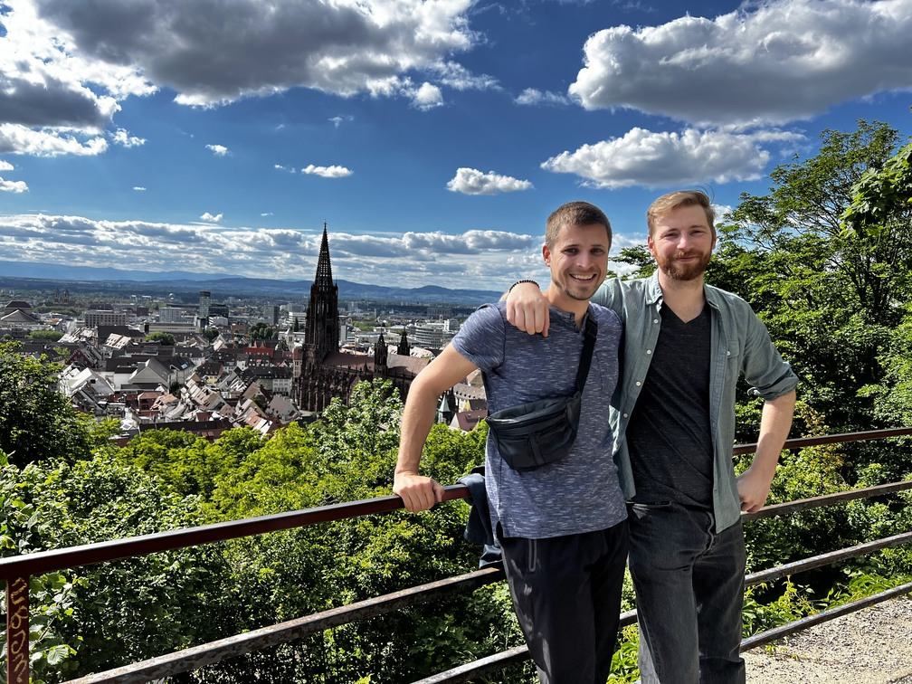

Countless footsteps across seven continents, numerous sunset views, and countless memories. Through my travels, I've collected a story in each nation and a picture from every single one of them. Every country I've wandered through offered a unique narrative, a chance to walk in an unfamiliar space, and the opportunity to uncover hidden treasures. The world is a book; every country, a chapter. Never let your curiosity cease - there's always a new chapter waiting to be read. The years indicate the first time, I have visted the country. While some stays were short, others lasted years. Some countries, I visited once, some more than ten times.

## 2022

### 75. Luxembourg

One of Europe's smallest countries, but resplendent in its fairy-tale-like charm, Luxembourg is an opulent patchwork of forests, rolling hills, and picturesque villages. [Luxembourg Wikipedia](https://en.wikipedia.org/wiki/Luxembourg)

### 74. Liechtenstein

Nestled between Switzerland and Austria, Liechtenstein is a serene testament to Europe's alpine beauty with towering mountains, charming villages, and regal castles. [Liechtenstein Wikipedia](https://en.wikipedia.org/wiki/Liechtenstein)

### 73. Jordan

Rich in history and culture, Jordan is a fond memory of the Middle East. From the well-preserved Roman architecture in Jerash to the timeless beauty of Petra and the serenity of the Dead Sea - this country is a timeless marvel. [Jordan Wikipedia](https://en.wikipedia.org/wiki/Jordan)

## 2021

### 72. Argentina

Land of fire and ice, Argentina is as diverse as it is vast. With vibrant cities like Buenos Aires, the breathtaking Andes mountain range, and glacial landscapes in Patagonia, the beauty of Argentina is without compare. [Argentina Wikipedia](https://en.wikipedia.org/wiki/Argentina)

### 71. Brazil

From the mellifluous rhythm of samba and the rich diversity of the Amazon rainforest to the iconic Christ the Redeemer in Rio de Janeiro, Brazil embodies a delightful fusion of music, culture, and nature. [Brazil Wikipedia](https://en.wikipedia.org/wiki/Brazil)

### 70. Georgia

Georgia is a hidden gem bordering Europe and Asia. The tapestry of quaint villages, historic churches, vibrant culture and delectable food make it a fantastic travel spot. [Georgia Wikipedia](https://en.wikipedia.org/wiki/Georgia_(country))

### 69. Romania

Steeped in folklore, Romania is a country of diverse beauty. From the enigmatic Bran Castle connected to the Dracula legend in Transylvania, to the vibrant city life of Bucharest, Romania captivates. [Romania Wikipedia](https://en.wikipedia.org/wiki/Romania)

### 68. Bulgaria

Nestled with stunning beauty at every turn, Bulgaria offers everything–from the golden beaches of the Black Sea to ancient cultural cities and ski resorts in Pirin Mountains. [Bulgaria Wikipedia](https://en.wikipedia.org/wiki/Bulgaria)

### 67. Mauritius

A slice of paradise on earth, Mauritius delivers azure waters, pristine beaches, rich flora and fauna, and the vibrant mosaic of cultures. [Mauritius Wikipedia](https://en.wikipedia.org/wiki/Mauritius)

## 2020

_Keep in mind this was a challenging year for travel due to the Covid-19 pandemic. Despite these challenges, the captivating allure of each country shone brightly._

### 66. Montenegro

Encapsulating the beauty of the Adriatic coast, Montenegro is a pocket-sized package full of medieval towns, glistening bays, rugged mountains, and friendly local people. [Montenegro Wikipedia](https://en.wikipedia.org/wiki/Montenegro)

### 65. Northern Ireland 

A land of ethereal beauty and rich history, Northern Ireland is a story well told through Giant's Causeway's hexagonal stones and hauntingly beautiful landscapes used as filming sites for Game of Thrones. [Northern Ireland Wikipedia](https://en.wikipedia.org/wiki/Northern_Ireland)

### 64. St Vincent

A jewel of the Caribbean, St Vincent boasts sapphire blue waters, incredible volcanic landscapes, lush botanical gardens, and a vibrant, irresistible island culture. [St Vincent Wikipedia](https://en.wikipedia.org/wiki/Saint_Vincent_(Antilles))

### 63. St. Lucia

With its iconic Piton mountains, idyllic beaches, and lush rainforests, St. Lucia is a Caribbean island that encapsulates tropical charm. [St. Lucia Wikipedia](https://en.wikipedia.org/wiki/Saint_Lucia)

### 62. Martinique

French sophistication meets Caribbean warmth in Martinique. With its vibrant markets, colonial architecture, and powdery white sand beaches, this island Quot offers a unique mix of cultures and landscapes. [Martinique Wikipedia](https://en.wikipedia.org/wiki/Martinique)

### 61. Lebanon

Lebanon, where rich history meets Mediterranean charm. From the mystical ruins of Byblos and Baalbek to the bustling nightlife of Beirut, this Middle Eastern gem radiates a timeless allure. [Lebanon Wikipedia](https://en.wikipedia.org/wiki/Lebanon)

### 60. Serbia

Steeped in history and alive with vibrant culture, Serbia is a country where the past and present collide. The capital, Belgrade, brims with bohemian energy and fortress views, while the countryside offers sublime natural landscapes. [Serbia Wikipedia](https://en.wikipedia.org/wiki/Serbia)

## 2019

### 59. Cyprus

From legendary Aphrodite’s Rock to the byzantine Kykkos Monastery and beautiful beaches of Ayia Napa, Cyprus is an amalgamation of history, nature, and Mediterranean charm. [Cyprus Wikipedia](https://en.wikipedia.org/wiki/Cyprus)

### 58. Malta

Tucked in the heart of the Mediterranean, Malta is known for its ancient megalithic temples, imposing fortresses, and the stunning Blue Lagoon. [Malta Wikipedia](https://en.wikipedia.org/wiki/Malta)

### 57. New Zealand

Land of the long white cloud (Aotearoa), New Zealand is a haven of awe-inspiring landscapes –from the towering Mount Cook to the magical lands of Hobbits, Maori culture, and the adventure capital-Queenstown. [New Zealand Wikipedia](https://en.wikipedia.org/wiki/New_Zealand)

## 2018

### 56. Australia

Australia is a land of contrasts: from the barren Outback, home to the iconic Ayers Rock, to the stunning Great Barrier Reef, and cosmopolitan cities like Sydney and Melbourne, it never ceases to amaze. [Australia Wikipedia](https://en.wikipedia.org/wiki/Australia)

### 55. United Arab Emirates

Beyond the glimmering skyscrapers of Dubai and the monumental riches of Abu Dhabi, the United Arab Emirates fascinates with its blend of Bedouin traditions and modern opulence. [United Arab Emirates Wikipedia](https://en.wikipedia.org/wiki/United_Arab_Emirates)

### 54. Egypt

The mystifying land of the Pharaohs–Egypt is a treasure trove of ancient wonders, from the awe-inspiring pyramids of Giza to the hieroglyph-lined Karnak Temple and Valley of the Kings. [Egypt Wikipedia](https://en.wikipedia.org/wiki/Egypt)

### 53. Morocco

A gateway to Africa, Morocco is a country of dizzying diversity. Its ancient cities, epic mountain ranges, sweeping deserts, and warm hospitality make it a captivating realm of adventure. [Morocco Wikipedia](https://en.wikipedia.org/wiki/Morocco)

### 52. Vatican

As the world's smallest independent city-state, the Vatican City holds an enigmatic appeal with St. Peter's Basilica, Vatican Museums, and the Sistine Chapel, home to Michelangelo's magnificent frescoes. [Vatican Wikipedia](https://en.wikipedia.org/wiki/Vatican_City)

### 51. Bosnia

Bosnia is a mosaic of cultural heritage and natural beauty, reflecting both Ottoman and Austro-Hungarian influences in its historic cities, while boasting serene landscapes dotted with quaint villages. [Bosnia Wikipedia](https://en.wikipedia.org/wiki/Bosnia_and_Herzegovina)

### 50. Greece

A cradle of Western Civilization, Greece entrances with its iconic ancient ruins like the Parthenon, stunning islands like Santorini and Crete, and the welcoming warmth of Hellenic culture. [Greece Wikipedia](https://en.wikipedia.org/wiki/Greece)  

### 49. Albania

A Balkan gem, Albania offers a rich tapestry of experiences from its striking mountains and breathtaking coastal towns to historic sites bearing witness to Illyrian, Greek, Roman, and Ottoman periods. [Albania Wikipedia](https://en.wikipedia.org/wiki/Albania)  

### 48. Macedonia

A testament to the rich history of the Balkans, Macedonia (now North Macedonia) dazzles with its stunning natural landscapes, historical treasures, and vibrant cities like the capital, Skopje. [Macedonia Wikipedia](https://en.wikipedia.org/wiki/North_Macedonia)

### 47. Latvia

As one of the Baltic states, Latvia spellbinds with its captivating mix of charming medieval Old Towns, pristine natural parks, and modern urban dynamism in cities like Riga.[Latvia Wikipedia](https://en.wikipedia.org/wiki/Latvia)

### 46. Lithuania

From the atmospheric streets of Vilnius Old Town to the stunning beauty of the Curonian Spit, Lithuania is a captivating weave of culture, history, and nature. [Lithuania Wikipedia](https://en.wikipedia.org/wiki/Lithuania)

### 45. Finland

Land of a thousand lakes, Finland stirs the soul with its breathtaking natural landscapes, the glow of the midnight sun, and the mystic allure of the Northern Lights. [Finland Wikipedia](https://en.wikipedia.org/wiki/Finland)

### 44. Estonia

From the medieval charm of Tallinn to the wilderness of its national parks, Estonia amazes with its rich history, vibrant culture, and stunning Nordic landscapes. [Estonia Wikipedia](https://en.wikipedia.org/wiki/Estonia)

### 43. Slovakia

Guarded by majestic castles and invigorating mountain ranges, Slovakia is an enchanting haven for adventurers and history lovers alike. [Slovakia Wikipedia](https://en.wikipedia.org/wiki/Slovakia)

### 42. Colombia

A testament to resilience and culture, Colombia bursts with vibrancy–from the colorful streets of Cartagena to the rich coffee plantations and the pulsating rhythm of salsa. [Colombia Wikipedia](https://en.wikipedia.org/wiki/Colombia)

### 41. Bolivia

A country of extremes–from the dizzying heights of La Paz to the ethereal beauty of Salar de Uyuni, Bolivia delivers an awe-inspiring showcasing of nature's grandeur. [Bolivia Wikipedia](https://en.wikipedia.org/wiki/Bolivia)

## 2017

### 40. Peru

Home to the legendary Machu Picchu, the enigmatic Nazca Lines, and the vibrant city of Lima, Peru merges the ancient and modern in an ever-intriguing dance. [Peru Wikipedia](https://en.wikipedia.org/wiki/Peru)

### 39. Panama

Connecting North and South America, Panama springs forth with its world-renowned canal, charming Casco Viejo, and abundant natural reserves. It's a paradise for history buffs and nature lovers alike. [Panama Wikipedia](https://en.wikipedia.org/wiki/Panama)

### 38. Iceland

Field of the geysers, land of the midnight sun, and home to the magical Northern Lights –Iceland's enchanting landscapes are a testament to the raw power and sheer beauty of Mother Nature. [Iceland Wikipedia](https://en.wikipedia.org/wiki/Iceland)

### 37. Wales

From the historic Cardiff Castle to the stunning landscapes of Snowdonia National Park, Wales is a place where myth and reality combine creating a land of true enchantment. [Wales Wikipedia](https://en.wikipedia.org/wiki/Wales)

### 36. Sri Lanka

An island nation blessed with pristine beaches, verdant tea plantations, and UNESCO World Heritage sites like Sigiriya, Sri Lanka is often referred to as the 'Pearl of the Indian Ocean'. [Sri Lanka Wikipedia](https://en.wikipedia.org/wiki/Sri_Lanka)

### 35. Qatar

A modern oasis in the heart of the Middle East, Qatar stands tall with its futuristic skyscrapers, lavish lifestyle, beautiful sand dunes of Khor Al Adaid and the iconic Museum of Islamic Art. [Qatar Wikipedia](https://en.wikipedia.org/wiki/Qatar)

## 2016

### 34. Ireland

Emerald Isle, as Ireland is fondly known, is a treasure trove of turquoise coastline, rolling green hills, age-old castles, and a rich culture defined by folklore and spirited music. Gaelic charm, friendly locals and legendary pubs make Ireland a must-visit. [Ireland Wikipedia](https://en.wikipedia.org/wiki/Ireland)

### 33. Mexico

Mexico is a colourful tapestry of ancient Mayan ruins, vibrant cuisine, energetic dances and bustling markets. Marvel at the Chichen Itza, unwind at pristine beaches of Cancun, or enjoy the festive spirit of Dia de Los Muertos. [Mexico Wikipedia](https://en.wikipedia.org/wiki/Mexico)

### 32. Denmark

Known as the happiest country in the world, Denmark is an appealing mélange of colourful streets leading to cosy cafes, royal palaces, and innovative modern design. Don't forget to swing by the mesmerising Little Mermaid statue! [Denmark Wikipedia](https://en.wikipedia.org/wiki/Denmark)

### 31. Sweden

Sweden, the land of Vikings, presents stunning archipelagos, the modern-meets-medieval city of Stockholm and the mystical allure of the Northern Lights. It's also proud to be home to the iconic ABBA and IKEA. [Sweden Wikipedia](https://en.wikipedia.org/wiki/Sweden)

### 30. Croatia

Enchanting Adriatic seafront, picturesque islands, the ancient city of Dubrovnik and the breathtaking Plitvice Lakes make Croatia a Mediterranean gem hard to resist. [Croatia Wikipedia](https://en.wikipedia.org/wiki/Croatia)

### 29. Slovenia

A hidden European gem, Slovenia dazzles with its diverse landscapes, from the soaring peaks of the Julian Alps and the mysterious underground world of Postojna Cave to the serene beauty of Lake Bled. [Slovenia Wikipedia](https://en.wikipedia.org/wiki/Slovenia)

### 28. Portugal 

Portugal seduces with its old-world charm, sublime coastline, endearing cities like Lisbon and Porto, and a hearty cuisine highlighted by delicious pastéis de nata and Porto wine. Did we mention it's also the birthplace of Cristiano Ronaldo? [Portugal Wikipedia](https://en.wikipedia.org/wiki/Portugal)

### 27. Canada

Canada, the second-largest country by land area, boasts of vastly diverse landscapes, ranging from the rugged Rocky Mountains to the vast Arctic tundra. Whether it's exploring the dynamic city of Toronto or immersing oneself in the unspoiled beauty of Banff National Park, Canada offers a unique mosaic of experiences. [Canada Wikipedia](https://en.wikipedia.org/wiki/Canada)

### 26. United States

The Land of Opportunity and Freedom, the United States is where skyscrapers rise in bustling cities like New York and LA, natural wonders abound from Grand Canyon to Great Smoky Mountains, and where the spirit of liberty resonates through the iconic Statue of Liberty. [United States Wikipedia](https://en.wikipedia.org/wiki/United_States)

## 2014

The journey through time and space continues...

### 25. Turkey

Where East meets West, Turkey is a fusion of rich history, diverse cultures, and remarkable landscapes. From vibrant Istanbul to the surreal terrain of Cappadocia, the Roman ruins of Ephesus to the poignant Gallipoli Peninsula, it's a voyage of discovery. [Turkey Wikipedia](https://en.wikipedia.org/wiki/Turkey)

### 24. Czechia

Whimsical castles, dreamy spires, and ornate buildings line the architectural paradise of Czechia. Prague, the 'City of a Hundred Spires,' wows with its captivating beauty while Český Krumlov and Kutná Hora possess a medieval charm. [Czechia Wikipedia](https://en.wikipedia.org/wiki/Czechia)

### 23. Japan

Japan captivates with an intoxicating blend of ultra-modern technology and age-old traditions. Bask in the pink blush of the famous cherry blossoms, walk the quaint streets of Kyoto, or break the bustling rhythm of Tokyo with zen moments at serene shrines. Sushi, Samurai, Shogunate, and Sumo wrestling define the J-power. [Japan Wikipedia](https://en.wikipedia.org/wiki/Japan)

### 22. China

China's grandeur lies in the breathtaking Great Wall, the legendary Forbidden City, and the precious Terracotta Army. Its landmarks narrate a rich history, while its dynamic cities echo progress. Let's not forget its mouth-watering cuisines - from Peking duck to dumplings. [China Wikipedia](https://en.wikipedia.org/wiki/China)

### 21. Malaysia

Home of the iconic Petronas Twin Towers, Malaysia is a multicultural nation blessed with tropical rainforests, beautiful islands, colonial architecture, and delightful street food. Its capital, Kuala Lumpur, is a bustling city with a mix of old and new. [Malaysia Wikipedia](https://en.wikipedia.org/wiki/Malaysia)

### 20. Cambodia

Stepping into Cambodia is like traveling back in time, to the Khmer Empire's glorious times evident in the magnificent Angkor Wat, a UNESCO World Heritage Site. Its capital, Phnom Penh, reveals the country's poignant history and resilient spirit. [Cambodia Wikipedia](https://en.wikipedia.org/wiki/Cambodia)

### 19. Thailand

Thailand, the Land of Smiles, greets you with golden shrines, ornate palaces, white sand beaches, and bustling night markets. Whether it's the vibrant Bangkok or the idyllic islands of Phuket and Krabi, every turn invigorates your senses. [Thailand Wikipedia](https://en.wikipedia.org/wiki/Thailand)

### 18. Vietnam

Vietnam paints a picture of simplicity, resilience, and beauty. Drift along the emerald waters of Halong Bay, trek through Sapa's terraced fields, explore Hoi An's ancient streets, or taste the world-famous pho. Its vibrancy is irresistible! [Vietnam Wikipedia](https://en.wikipedia.org/wiki/Vietnam)

### 17. Taiwan

Famed for its bustling night markets, olden temples, and verdant landscapes, Taiwan shines with a unique charm. Taipei 101 stands tall as a symbol of its progress, while the scenic Taroko Gorge showcases its natural splendor. [Taiwan Wikipedia](https://en.wikipedia.org/wiki/Taiwan)

### 16. Philippines

Boasting over 7,000 islands, the Philippines invites you to explore its shimmering blue waters, powdery white beaches, and biodiverse marine life. Add to that a rich history, friendly locals, and a delectable cuisine, and you're in for a treat. [Philippines Wikipedia](https://en.wikipedia.org/wiki/Philippines)

### 15. Macau

Known as ‘Vegas of China,’ Macau is a powerhouse of gambling, glitz, and glamour. But it's not all about casinos; the Historic Centre of Macau echoes its Portuguese influence and serves as a UNESCO World Heritage site. [Macau Wikipedia](https://en.wikipedia.org/wiki/Macau)

### 14. Hong Kong

Asia's World City, Hong Kong, surprises with a skyline punctuated by skyscrapers, markets buzzing with life, tranquil monasteries tucked away amidst mountains, and stunning views from Victoria Peak. It's a place where East meets West, and tradition meets innovation. [Hong Kong Wikipedia](https://en.wikipedia.org/wiki/Hong_Kong)

### 13. Switzerland

Natural beauty, precision, and sophistication beautifully blend in Switzerland. From snow-capped Alpine mountains to the tranquil waters of Lake Geneva, the cosmopolitan spirit of Zurich, and the charm of Lucerne - there's much to appreciate. Swiss chocolate and watch, anyone? [Switzerland Wikipedia](https://en.wikipedia.org/wiki/Switzerland)

### 12. Israel

Immerse yourself in the spiritual tapestry, impressive archaeology, and diverse cultures of Israel. Jerusalem stands as a religious beacon, while Tel Aviv throbs with a modern tempo. Don't miss out on the buoyant experience at the Dead Sea. [Israel Wikipedia](https://en.wikipedia.org/wiki/Israel)

## 2013

Are you ready to continue this extraordinary journey? Here we go!

### 11. Poland

Poland gracefully knits together a story of historic resilience, picturesque landscapes, architectural wonders, and hearty cuisine. Tracy along the Royal Route in Warsaw, or visit the poignant Auschwitz-Birkenau concentration camp for a deep dive into the past. [Poland Wikipedia](https://en.wikipedia.org/wiki/Poland)

## 2012

Our past journeys have been incredible. But there's more to explore. Come along as the adventure unfolds...

### 10. Hungary

Hungary beckons with thermal baths, dazzling architecture, a robust wine culture, and the picturesque Danube Bend. Budapest, its capital, is notably one of the most beautiful cities in the world. [Hungary Wikipedia](https://en.wikipedia.org/wiki/Hungary)

## Before 2012

Even though we're going years back, these extraordinary journeys still feel fresh. Let's revisit them...

### 9. San Marino

One of the world’s smallest countries, San Marino, offers charming sights, from the captivating views atop Mount Titano to its medieval old town. It's a haven for history lovers, stamp collectors, and those seeking to explore unusual locales. [San Marino Wikipedia](https://en.wikipedia.org/wiki/San_Marino)

### 8. Italy

Italy, a feast for the senses - Rome's Colosseum, Pisa's Leaning Tower, Florence's Renaissance art, Venice's canals, and Naples' pizza, all do a delightful Tarantella with travelers' hearts. [Italy Wikipedia](https://en.wikipedia.org/wiki/Italy)

### 7. Spain

Land of flamenco and fiesta, Spain jazzes up with passion for life. Culture echoes through the Alhambra, art comes alive at the Prado Museum, and the energy is palpable in Madrid's Puerta del Sol. Ole! [Spain Wikipedia](https://en.wikipedia.org/wiki/Spain)

### 6. England 

England, home to the royal Buckingham Palace, the scholarly Oxford, and the iconic Stonehenge, is a land rich in history, tradition, and culture. And yes, we can't forget the illustrious detective, Sherlock Holmes! [England Wikipedia](https://en.wikipedia.org/wiki/England)

### 5. Netherlands

Awashed with tulip fields, dotted with windmills, and crisscrossed by canals, the Netherlands is a nation of color and charm. Whether it's exploring the artistic gifts of Van Gogh or reveling in Amsterdam's vibrant nightlife, the country is enticingly versatile. [Netherlands Wikipedia](https://en.wikipedia.org/wiki/Netherlands)

### 4. Belgium

Known for its mouth-watering chocolates and sumptuous beer, Belgium is also home to grand squares, medieval towns, and age-old cathedrals. Don't miss out on the comic strip art featuring the beloved hero Tintin. [Belgium Wikipedia](https://en.wikipedia.org/wiki/Belgium)

### 3. France

From the romantic Eiffel Tower to the glamourous French Riviera, the Lavender fields of Provence to the majestic Mont Blanc, France captures hearts with its elegance, gastronomy, history, and fashion. Say bonjour to love! [France Wikipedia](https://en.wikipedia.org/wiki/France)

### 2. Austria

Austria, from the melodic notes of Mozart to the grandeur of the Habsburgs, the beauty of the Danube Valley to the thrills of the Austrian Alps, it's a symphony of culture, history, and nature. [Austria Wikipedia](https://en.wikipedia.org/wiki/Austria)

### 1. Germany

Germany narrates a tale of powerhouse cities like Berlin, fairytale castles like Neuschwanstein, harrowing historic sites like the Berlin Wall, scenic beauty of the Black Forest, and legendary festivals like Oktoberfest. It's a fascinating journey of discovery. [Germany Wikipedia](https://en.wikipedia.org/wiki/Germany)

And that completes the thrilling ride through 75 countries. A cavalcade of unforgettable experiences, intriguing cultures, magnificent landscapes, and myriad stories. Here's to our shared spirit of exploration and wanderlust!
