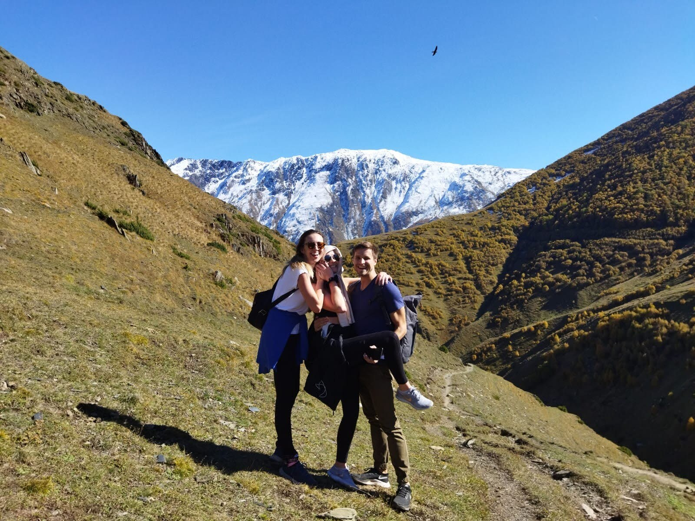
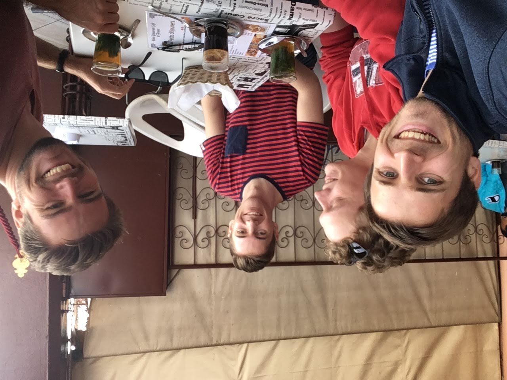
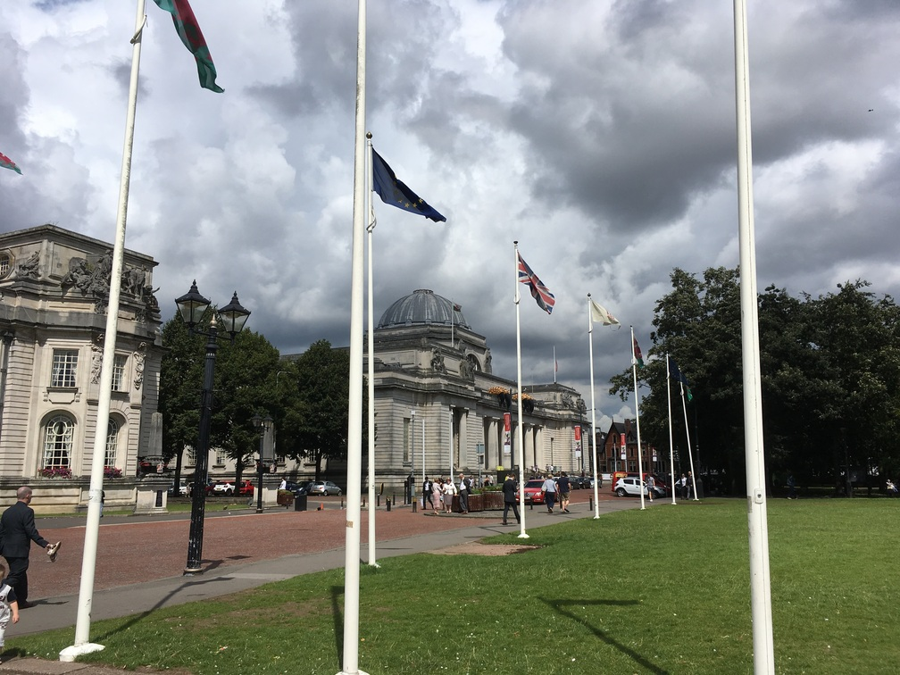
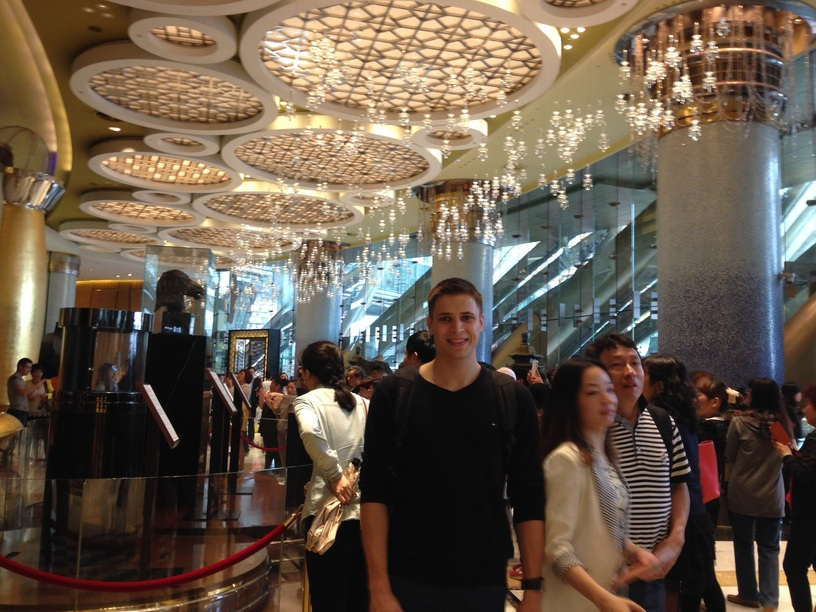

--- 
title: A Picture of Every Country I've Visited
tags: [Instructions]
style: fill
color: warning
description: I've been to 75 countries. 
---

## 2022

### Argentina

### Brazil

### Jordan

### Liechtenstein

### Luxembourg

## 2021

### Mauritius

### Bulgaria

### Romania

### Georgia

## 2020

### Martinique

### Serbia

### St Vincent

### Lebanon

### St Lucia

### Montenegro

### North Ireland

## 2019

### Malta

### Cyprus

## 2018

### New_Zealand

### Bosnia

### Macedonia

### Vatican

### Egypt

### United_Arab_Emirates

### Greece

### Albania

### Finland

### Lithuania

### Slovakia

### Morocco

### Australia

### Latvia

### Estonia

### Colombia

### Bolivia

## 2017

### Sri Lanka

### Peru

### Wales

### Iceland

## 2016

### Croatia

### Ireland

### Slovenia

### Portugal

### Mexico

## 2015

### United States

### Canada

### Sweden

### Denmark

### Czechia

## 2014

### Turkey

### China

### Thailand

### Philippines

### Vietnam

### Japan

### Israel

### Hong Kong

### Macau

### Malaysia

### Taiwan

### Cambodia

### Switzerland

## 2013

### Poland

## before 2013

### Italy

### Netherlands

### Spain

### Austria

### San Marino

### Germany

### Hungary

### England

### Belgium

### France

