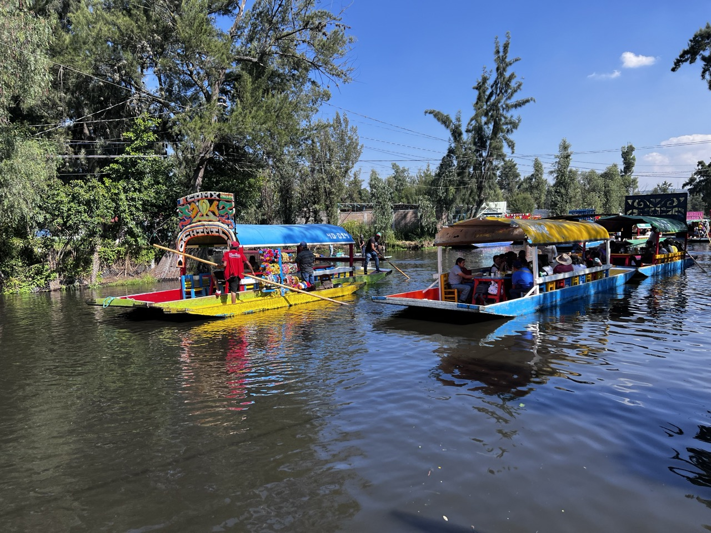
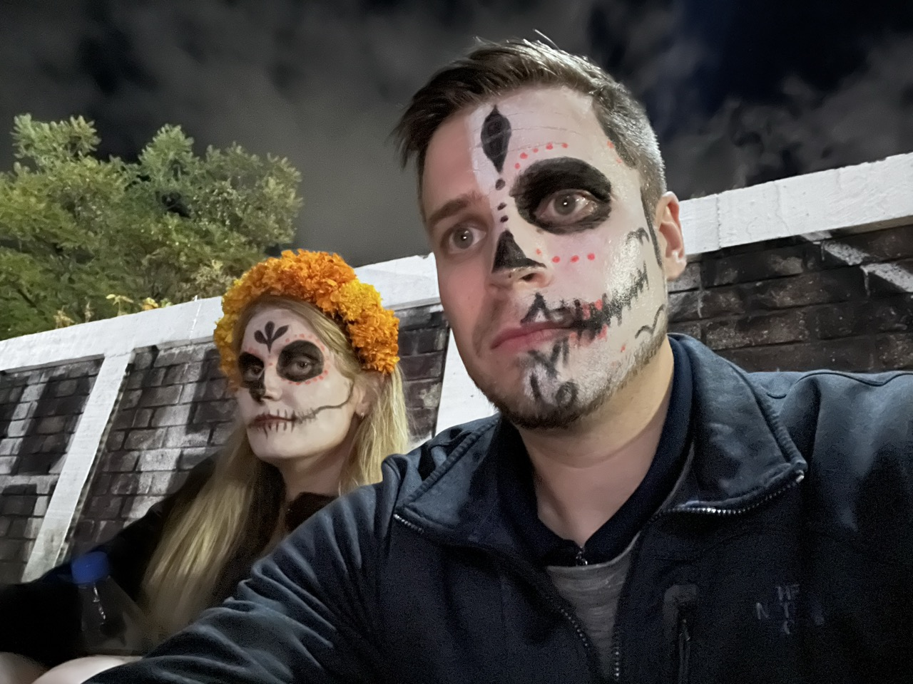

[Insert Picture]

From the tranquil canals of Xochimilko to the lively Dia de los Muertos celebration in Oaxaca, our trip across Mexico offered not just entertainment, but a profound exploration of culture, art, and history. The journey was carried out with our witty, adventurous, and lively 40+ travel tribe, offering unique, unforgettable experiences! Here is a glimpse into the magic the vibrant cities of Oaxaca and Mexico City beheld.

**Xochimilko in Mexico City** 

Our trip kicked off in the colorful district of Xochimilko, known for its vibrant and lively floating markets. Exploring the tranquil canals on traditional “trajineras,” beautifully crafted boats, was like snorkeling on the surface of a rainbow. The canals were bustling with merchants selling food, local artisans displaying their crafts, and mariachi bands setting the mood with their lively tunes. 

**Dia de los Muertos in Oaxaca**

Oaxaca, famous for the most exuberant 'Dia de los Muertos' - Day of the Dead celebration, was our next stop. The traditional marigold-decorated altars, sugar skull adorned cemeteries, candlelit processions, and colorful skull face paints created an atmosphere that was sultry, mystical, and utterly captivating. The celebration was a heartfelt remembrance of the departed, intertwined with joyous festivities - an experience that taught us powerful lessons about life, death, and the art of remembrance.

**Street Art & Museums**

Our journey was replete with a delightful potpourri of contemporary street art, classical murals, and world-class museums. The raw splashes of street art across the cityscape voiced stories of rebellion, hope, and dreams, while the museums held treasures of ancient civilizations and contemporary marvels.

**Parades and Dancing with our 40+ Nomad**

Our 40+ Nomad added a splash of thrill and excitement to the roving parties and parades. Dancing with the vividly dressed dancers in the busy streets ignited an atmosphere of carnival and camaraderie that was simply irresistible. Dancing until our feet numb, we discovered the joy of immersing oneself in the rhythm of local culture.

**Horseback Riding in the Oaxacan Mountains**

One of the highlights of our trip was a thrilling horseback ride into the sun-kissed mountains of Oaxaca. Trekking under the enveloping canopy of lush forests, accompanied by the sky-meeting mountain peaks, was an exhilarating experience that awakened our adventure spirits.

**Monte Alban Ruins**

A step into the ancient Monte Alban ruins was like time-traveling to a forgotten era. Once a city teeming with the Zapotec civilization, its remains whispered of grandeur, telling tales of a civilization that had been. Taking in the monumental structures, hieroglyphs, tombs, and temples was like reading a stone diary etched in time.

**Hierve el Agua & Petrified Waterfalls** 

Our final destination was the natural rock formations of Hierve el Agua, resembling cascading waterfalls. The petrified waterfall and the mineral-infused springs offered a serene spectacle, capturing the beauty of nature’s unusual wonders. Taking a dip in the natural pools overlooking the breathtaking valley below was the perfect ending to an unforgettable journey.

This trip expanded our horizons, enriched our understanding of diverse cultures, and blessed us with numerous once-in-a-lifetime experiences. We immersed ourselves in not just the touristy spectacles, but style="font-size: 1.2rem;">the very essence of Mexico - its soul-stirring art, vibrant festivals, inspiring history and the everyday life pulsating in its streets. It was a celebration of exploration that left footprints on our hearts, ones that will whisper stories of this captivating journey for years to come.
