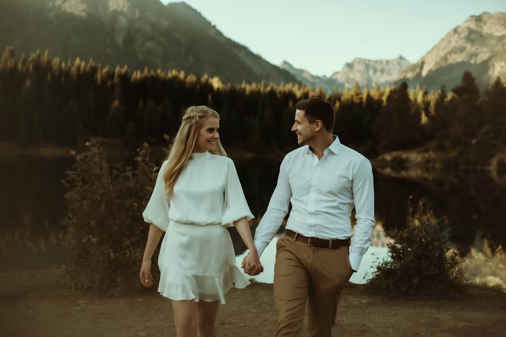

When we think about the future, it’s often shrouded with uncertainty and the intangible whims of fate. But what if we could sketch a blueprint of our tomorrows with the ink of today’s dreams and the quill of determination? In this blog, I invite you to traverse the corridors of my mind, which echo with aspirations for a future as bright as the dawning sun on a horizon—my life goals for 2035.

**1. Always remain in exceptional spirits with my wife Joy.**

The heart's laughter and the soul’s serenity—these are the treasures that I yearn to cherish unceasingly with my life partner, Joy. For me, a life sprinkled with exuberance is not a mere desire but a necessity, as essential as the air we breathe. As we sail through the years, through calm and troubled waters, our spirits remain buoyant, held afloat by the life vest of mirth. Together, Joy and I aspire to make every moment shimmer with genuine happiness and mutual respect, nurturing a love that thrives in the joyous estate of the heart.

**2. Be a famous recognized voice for NLP: teach, publish, speak.**

The wizardry of words, the cryptic dance of neurons and language—Neuro-Linguistic Programming (NLP) serves as my wand, with which I aim to enchant minds and kindle transformations. By 2035, I envision being a luminary in the realm of NLP, my voice echoing through the halls of institutions, the pages of published works, and the digital amphitheaters of webinars and conferences. Teaching what I'm passionate about, casting the wisdom of experience into volumes that seek bookshelves and souls alike, and speaking on platforms where eager ears and curious minds congregate—this is the symphony I seek to conduct.

**3. Work for a hero company.**

A "hero company" is not merely an organization; it's a crucible of innovation, integrity, and inspiration that aligns with my values and enkindles a sense of purpose beyond profit. By 2035, my aspirations are tethered to the mast of a vessel that sails for a greater good, navigating through industry tides with the compass of human-centric and sustainable practices. To contribute my expertise to a company renowned for its impact, ethos, and vision is the legacy I intend to foster.

**4. Always remain healthy and sporty <170 lbs, run half marathon each year.**

Health and vitality are the sirens that beckon me to the shores of disciplined living and athletic endeavors. I commit to maintain the temple of my being under 170 pounds, a sanctuary where fitness and food create the psalms of wellness. Each year, as I lace up my running shoes and set forth on the pilgrimage that is the half marathon, I celebrate the vigor within my veins and the strength of my resolve.

**5. Purchase house & apartment in US/EU with Joy.**

Brick by brick, dream by dream, Joy and I plan to lay foundations in both the Old World and the New. A house that resonates with the American spirit of innovation and progress; an apartment that whispers tales of European history and charm—these are not just investments in real estate, but in the canvas of our lives. Our goal is to build abodes that are sanctuaries of warmth, cradles of memories, and strongholds of security, culminating in a legacy of love and belonging.

As 2035 approaches, this map of ambitions is not just penciled drafts on parchment. It's a declaration, a gazetteer of life's journey where the milestones stand as firm as the resolve that sets them. Join me in this odyssey, and may our parallel pursuits intertwine at the crossroads of fulfillment and joy. As I stride towards my goals, I extend a hand in camaraderie and invite you to share your own—together, let's reach our 2035 with hearts buoyant and dreams realized.