System Design in a Hurry

## Delivery Framework
A structured approach to system design interviews that will help you deliver a working system in 45 minutes.

The easiest way to sabotage your chances of getting an offer in your system design interview is to fail to deliver a working system. This is the most common reason that mid-level candidates fail these interviews. While a firm structure to your approach is important and your interviewer is not trained specifically to assess you on your delivery (often this gets bucketed into "communication"), in practice we've seen many candidates that perform significantly better by following a structure which both keeps them from getting stuck and ensures they deliver a working system.

## Recommended system design interview structure

### Requirements (~5 minutes)

The goal of the requirements section is to get a clear understanding of the system that you are being asked to design. To do this, we suggest you break your requirements into two sections.

1) Functional Requirements: Functional requirements are your "Users/Clients should be able to..." statements.
2) Non-functional Requirements: Non-functional requirements are statements about the system qualities that are important to your users. These can be phrased as "The system should be able to..." or "The system should be..." statements.
3) Capacity Estimation: Many guides you've read will suggest doing back-of-the-envelope calculations at this stage. We believe this is often unnecessary. Instead, perform calculations only if they will directly influence your design. 

### Core Entities (~2 minutes)

Next you should take a moment to identify and list the core entities of you system. This helps you to define terms, understand the data central to your design, and gives you a foundation to build on. These are the core entities that your API will exchange and that your system will persist in a Data Model. In the actual interview, this is as simple as jotting down a bulleted list and explaining this is your first draft to the interviewer.

### API or System Interface (~5 minutes)

Before you get into the high-level design, you'll want to define the contract between your system and its users. Oftentimes, especially for full product style interviews, this maps directly to the functional requirements you've already identified (but not always!). You will use this contract to guide your high-level design and to ensure that you're meeting the requirements you've identified.

### [Optional] Data Flow (~5 minutes)

For some backend systems, especially data-processing systems, it can be helpful to describe the high level sequence of actions or processes that the system performs on the inputs to produce the desired outputs. If your system doesn't involve a long sequence of actions, skip this!

We usually define the data flow via a simple list. You'll use this flow to inform your high-level design in the next section.

### High Level Design (~10-15 minutes)

Now that you have a clear understanding of the requirements, entities, and API of your system, you can start to design the high-level architecture. This consists of drawing boxes and arrows to represent the different components of your system and how they interact. Components are basic building blocks like servers, databases, caches, etc. This can be done either in person on a whiteboard or virtually using whiteboarding software like Excalidraw. The Key Technologies section below will give you a good sense of the most common components you'll need to know.

Ask your recruiter what software you'll be using for your interview and practice with it ahead of time. You don't want to be fumbling with the software during your interview.

### Deep Dives (~10 minutes)

Astute readers probably noticed that our simple, high-level design of Twitter is going to be woefully inefficient when it comes to fetching user's feeds. No problem! That's exactly the sort of thing you'll iterate on in the deep dives section. Now that you have a high-level design in place you're going to use the remaining 10 or so minutes of the interview to harden your design by (a) ensuring it meets all of your non-functional requirements (b) addressing edge cases (c) identifying and adressing issues and bottlenecks and (d) improving the design based on probes from your interviewer.

## Designs

### Uber

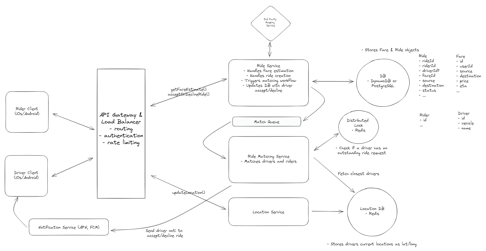

### Ticketmaster

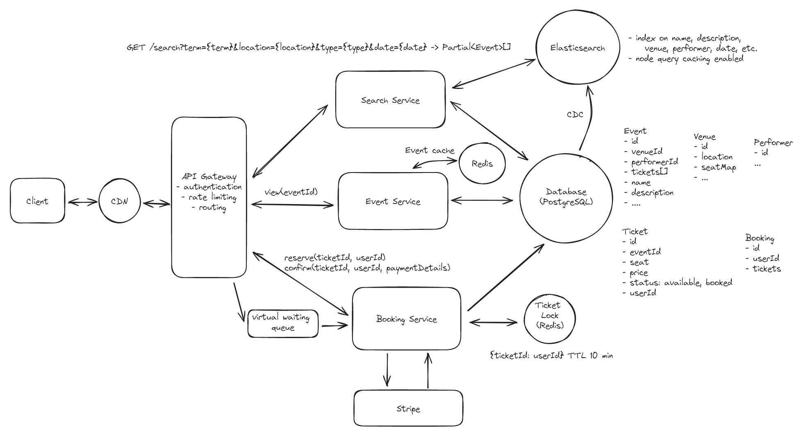

### Dropbox

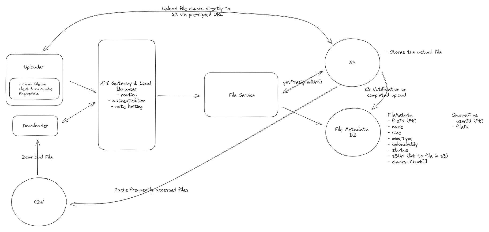

### Ad Click Generator

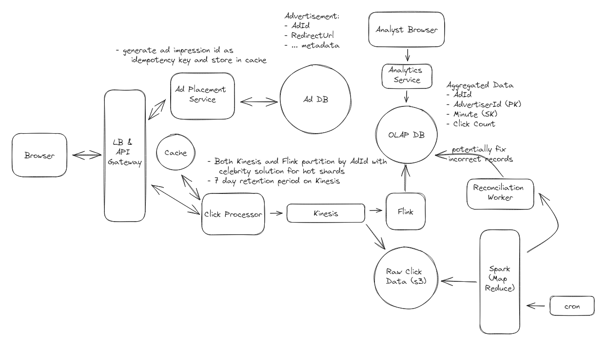

### Web Crawler

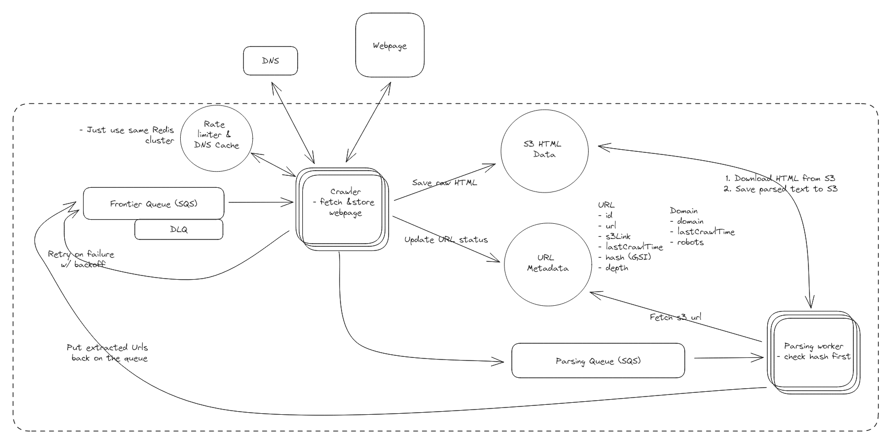

### Facebook Live Comments

### Facebook News Feed

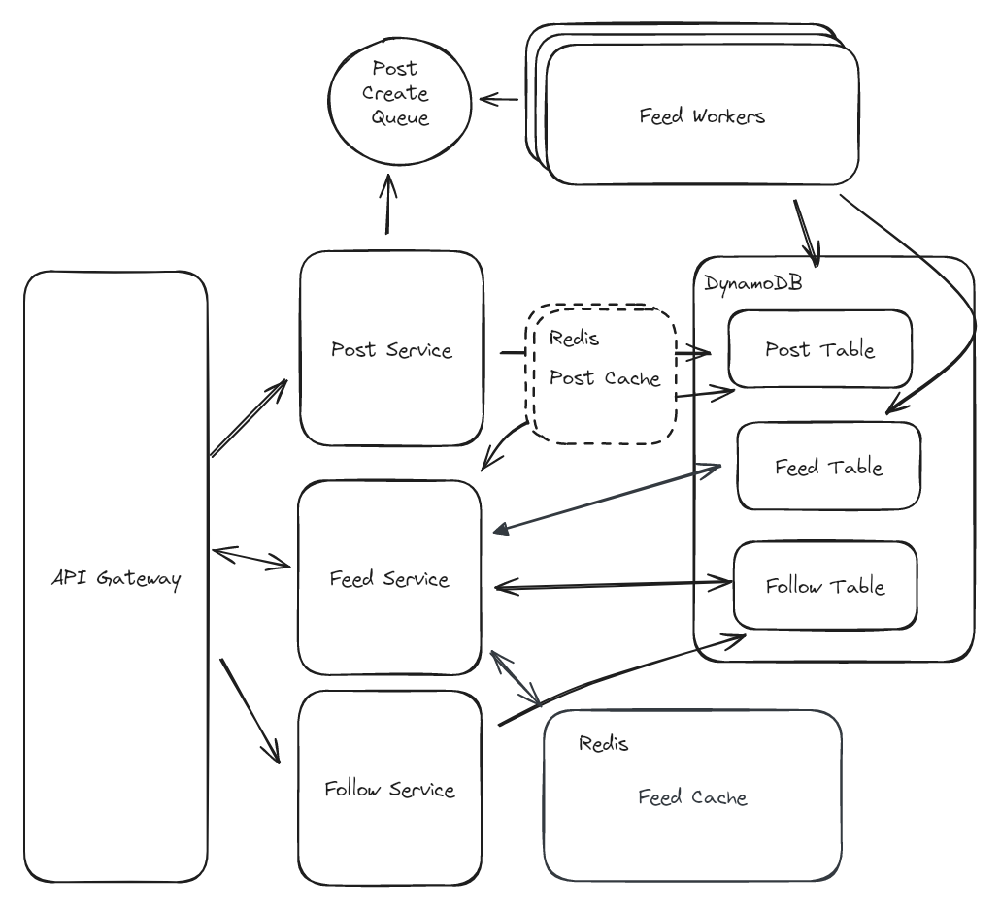

### Gopuff

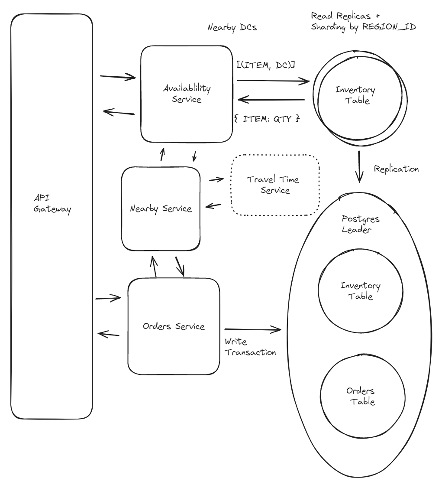

### Leetcode

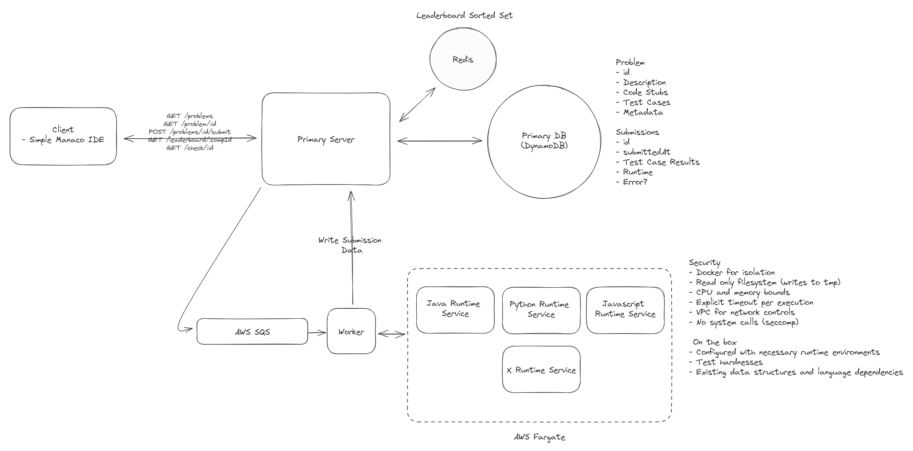

### Tinder

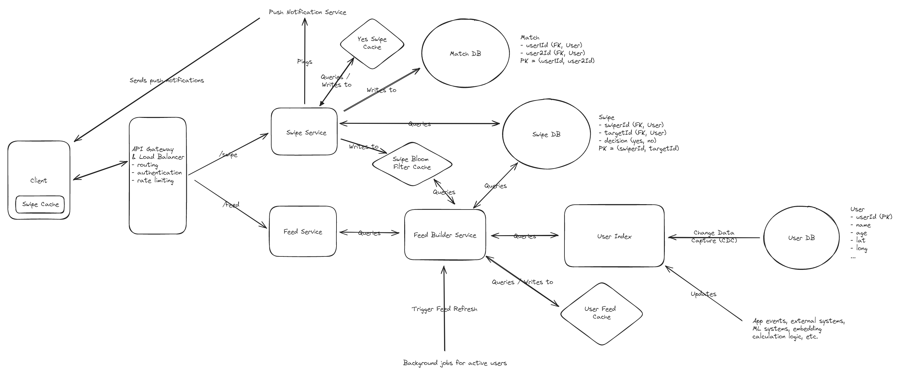

### Top-K Youtube

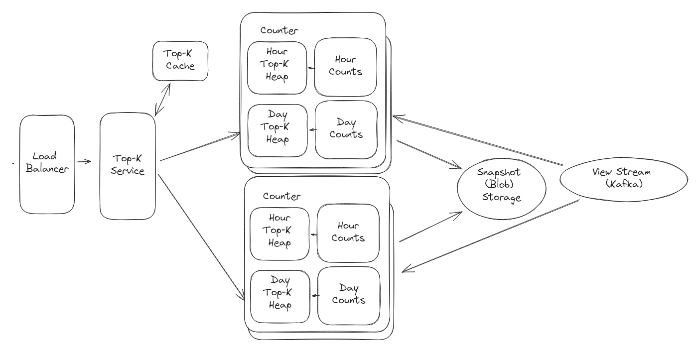

### Yotube

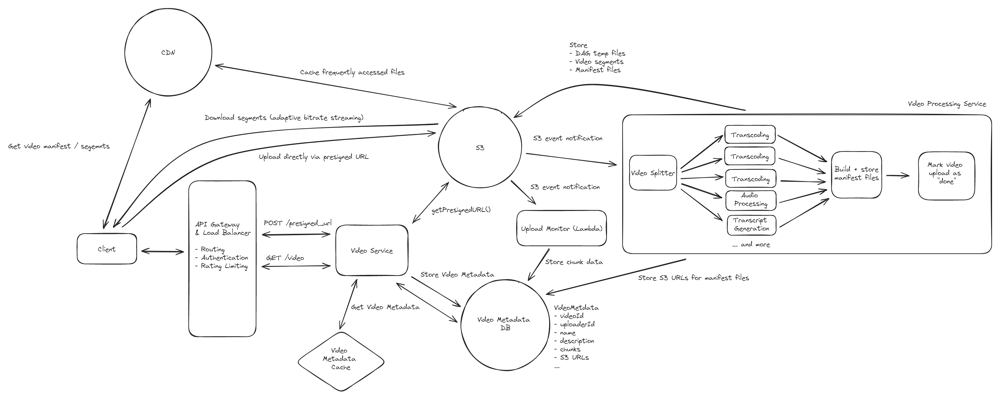

### Whatsapp

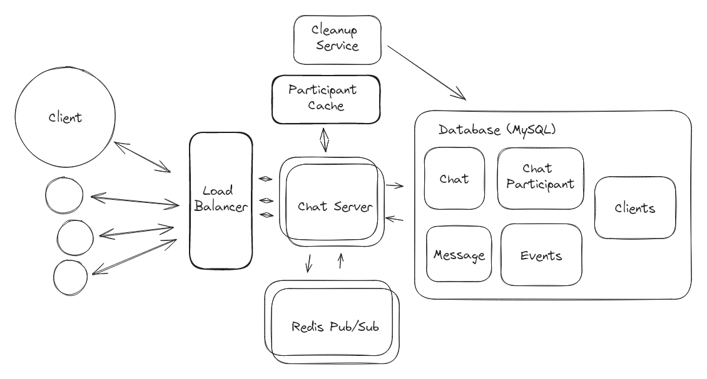