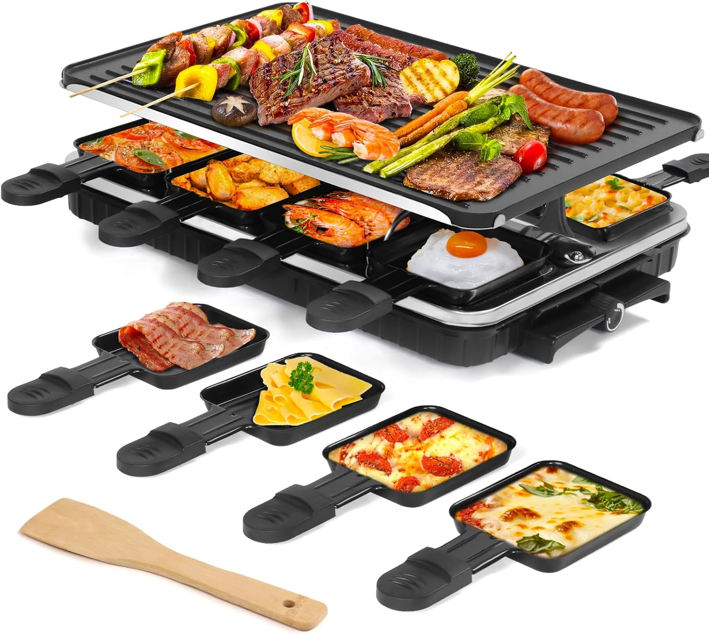

Every New Year’s Eve, we gather with friends and family to celebrate the end of a year and welcome the new one in the most delicious way possible—with **Raclette Night**. Raclette isn’t just a meal; it's an experience. It's cozy, interactive, and indulgent, making it the perfect centerpiece for a festive evening. And the best part? Everyone gets to customize their plate to their heart’s content.

If you’ve never done Raclette before, don’t worry! The concept is simple: melt creamy cheese over a bed of grilled goodies like veggies, meats, or potatoes. It’s a meal made for sharing and savoring. And this year, we’re making sure our shopping list is on point with ingredients that guarantee everyone leaves the table happy and *very* full.

Check out our comprehensive Raclette shopping list below, tailored for **four very hungry people**. This guide will have you covered, from the perfect cheese to the must-have veggies—because, after all, New Year’s is the time to go all out. So grab this list, head to your local grocery store, and gear up for an unforgettable start to the year.

---

### **Cheese: The Star of the Show**
It’s not Raclette without the cheese! Go for the traditional Raclette cheese if you can find it—it’s creamy, melts like a dream, and has just the right amount of nuttiness. Need a substitute? Gruyère, Comté, Emmental, or Fontina are all excellent alternatives. 

What to get:
- Raclette cheese: **1.75–2 lbs total (28–32 oz)**  
  *(7–8 oz per person)*

---

### **Meats: For Protein Lovers**
For meat enthusiasts, Raclette night offers endless possibilities. From juicy sausage slices to tender pieces of steak or chicken, these proteins pair beautifully with melted cheese. Make sure to have a mix of pre-cooked meats (like sausages) and raw ones you can grill together at the table.

What to get:
- Steak: **4–6 oz**  
- Chicken: **6–8 oz**  
- Turkey: **6–8 oz**  
- Sausages: **8 oz**  

(Target a total of around **2 lbs (32 oz)** of protein for 4 people.)

---

### **Veggies for Grilling/Dipping**
Raclette is an absolute veggie lover’s dream. Think of colorful, fresh vegetables that provide a perfect balance of texture and flavor with the richness of melted cheese. Grill these on your Raclette machine or in a hot skillet right at the table, and let everyone pick their favorites.

What to get:  
- Mini or small potatoes (Yukon Gold, fingerlings): **1.5 lbs (24 oz)**  
- Mushrooms (cremini or white button): **6–8 oz**  
- Bell peppers (red, yellow): **2 large peppers (~8–10 oz total)**  
- Zucchini: **6–8 oz**  
- Cherry or grape tomatoes: **8 oz**  
- Broccolini or broccoli florets: **6–8 oz**  
- Asparagus: **6–8 oz**

---

### **Bread: The Perfect Cheese Sponge**
A good, crusty loaf is essential for soaking up all that rich, gooey cheese. A fresh baguette is traditional, but you can also experiment with sourdough, rye, or any artisan bread you love.

What to get:
- Crusty baguette or artisan bread: **~1 lb (16 oz loaf)**  

---

### **The Raclette Night Vibe**
Once you gather all your ingredients, set up your Raclette grill or tabletop pan, and let the magic begin. Start grilling your vegetables and meats, boil some potatoes until tender, and slice that bread. Then, melt your Raclette cheese in individual trays (or in a skillet) and drizzle it all over your freshly grilled goodies. Want to make things extra festive? Pair your meal with a glass of crisp white wine or beer.

There’s something special about ending the year surrounded by good food, great company, and cheesy smiles. So whether this is your first time doing Raclette or a treasured yearly tradition, we hope this list inspires you to create your best New Year’s yet.

Here’s to a fantastic meal and an even better 2025! 🥂