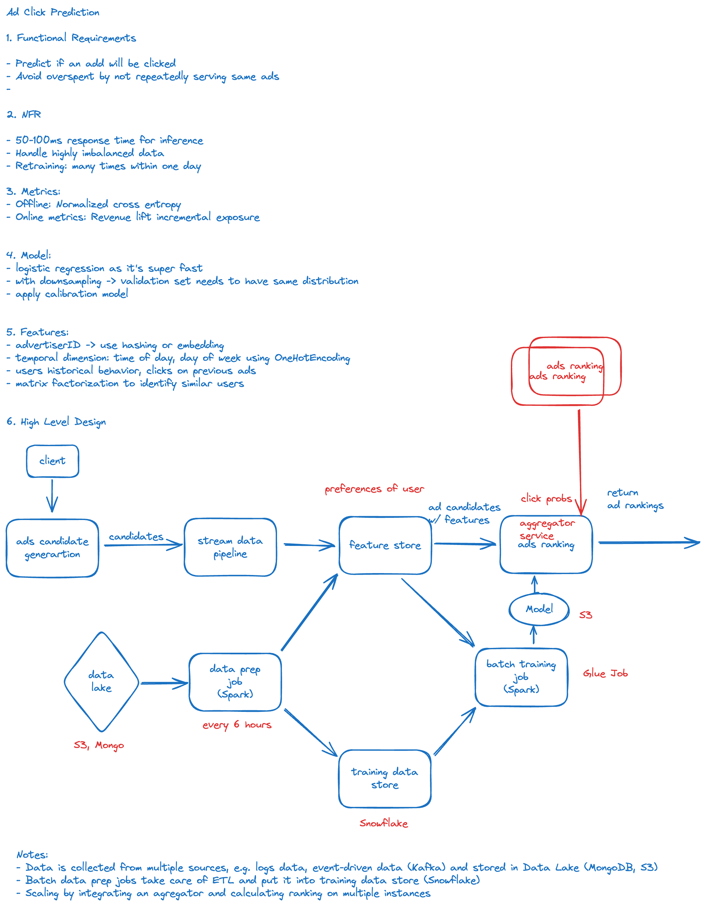

## Ad Click Prediction

Ad Click prediction case is a classic machine learning system design problem. The goal is to predict whether a user will click on an ad or not. The system design involves data collection, feature engineering, model training, and serving. The system should be able to handle a large number of requests and provide real-time predictions.

## Linkedin Feed Recommender

Feed recommendation on Linkedin is a machine learning system design problem. The goal is to recommend relevant posts to users based on their interests and activities. The system design involves data collection, feature engineering, model training, and serving. The system should be able to handle a large number of requests and provide real-time recommendations.

## Youtube Video Recommender

Youtube video recommendation is a machine learning system design problem. The goal is to recommend relevant videos to users based on their interests and activities. The system design involves data collection, feature engineering, model training, and serving. The system should be able to handle a large number of requests and provide real-time recommendations.
