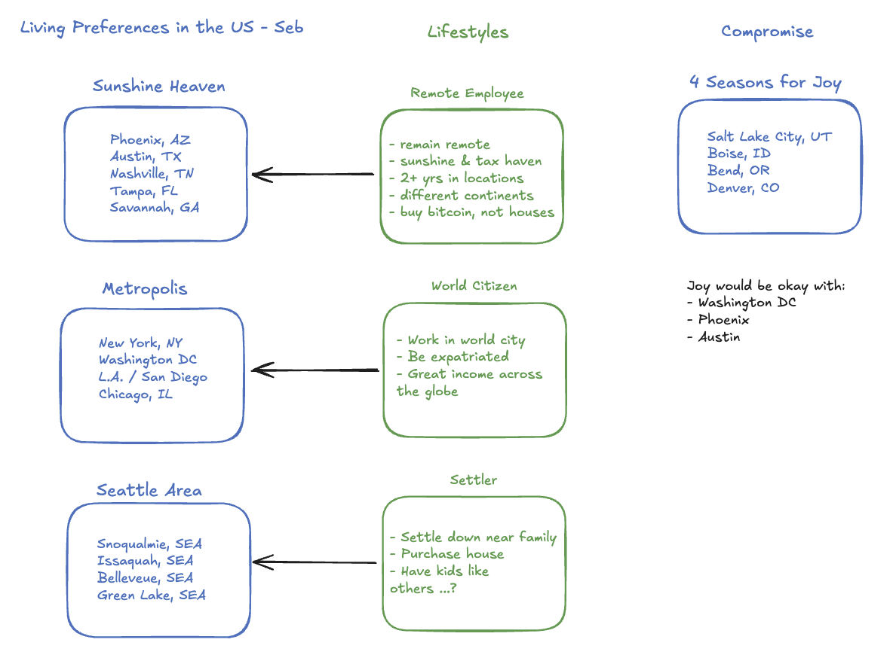

**Choosing Between Austin, TX; Washington, D.C.; and Phoenix, AZ: A Guide for Outdoor Enthusiasts and Coffee Lovers**

If you're considering a move from Seattle's scenic Green Lake area to Austin, Texas; Washington, D.C.; or Phoenix, Arizona, we completely understand the importance of finding a neighborhood that mirrors your love for the outdoors, community, and vibrant local culture. Green Lake’s balance of walkable parks, active running culture, and nearby coffee spots with a warm sense of community has set the bar high. But don’t worry—each of these cities has its own charm and can offer a neighborhood suited to your lifestyle. Let’s delve into what these cities have to offer for Seb, the outdoor enthusiast, and Joy, the yoga and coffee-loving connoisseur.

---

### **Option 1: Austin, Texas**
Austin is known for its outdoor-friendly vibe, fitness-oriented culture, and excellent coffee scene. As a rapidly growing city, it combines a laid-back vibe with robust offerings for athletes, yogis, and coffee enthusiasts alike.

#### **Neighborhood Recommendation: Zilker**
Zilker is Austin’s answer to Green Lake. The crown jewel of this neighborhood is **Zilker Metropolitan Park**, a massive outdoor haven where you’ll find miles of trails along the Barton Creek Greenbelt for running, walking, and biking. Barton Springs Pool, located in the park, is a favorite spot for cooling off post-run. Zilker is also close to downtown for easy access to trendy coffee shops and yoga studios.

- **For Seb:** Check out local running clubs like the **Austin Runners Club** or **Trail Roots**, which regularly organize group runs along the scenic trails of Lady Bird Lake and Zilker Park. For pickleball, Austin has a growing scene, with dedicated locations like **Austin Pickle Ranch** and outdoor public courts at **Zilker Elementary School** and the **South Austin Recreation Center**.
- **For Joy:** Yoga enthusiasts will love the abundance of studios, including **Practice Yoga Austin** and **Black Swan Yoga** (which offers donation-based classes). For coffee, iconic spots like **Merit Coffee** or **Cosmic Coffee + Beer Garden** are perfect for a relaxing pick-me-up.

**Bonus:** Austin’s food and live music scene will bring additional joy to your weekends, combining an active lifestyle with a wealth of entertainment.

---

### **Option 2: Washington, D.C.**
The nation’s capital may feel quite different from Seattle, but with its historic parks, thriving run communities, and dynamic coffee and yoga culture, D.C. offers a surprising amount for outdoor enthusiasts and coffee aficionados.

#### **Neighborhood Recommendation: Capitol Hill/Eastern Market**
Capitol Hill offers excellent walkability, proximity to the outdoors, and a bustling café culture, making it comparable to Green Lake. The nearby **National Mall** and **Anacostia Riverwalk** provide plenty of opportunities for running and outdoor activities.

- **For Seb:** Join the **DC Road Runners Club** or the popular **November Project DC** for group runs and fitness events at locations like the National Mall or Rock Creek Park. For pickleball, D.C. has embraced the trend with courts at the **Eastern Market Recreation Center**, **Randall Recreation Center**, and **Roosevelt Island Tennis Courts**.
- **For Joy:** Find your zen at studios like **Yoga District** or **Flow Yoga Center**, both known for their inclusive atmospheres. For coffee, you can’t go wrong with **Peregrine Espresso** or **Eastern Market’s own Blue Bottle Coffee**, great spots for sipping lattes while enjoying Capitol Hill’s historic charm.

**Bonus:** D.C.’s rich museums, farmers' markets, and proximity to nature (like Great Falls Park) offer a blend of cultural and outdoor experiences.

---

### **Option 3: Phoenix, Arizona**
Phoenix is a desert gem with year-round sunshine, abundant outdoor activities, and a growing cultural and fitness scene. For those coming from a lush, green environment like Seattle, the shift to the desert might take some adjustment. However, the many parks and vibrant neighborhoods will win you over.

#### **Neighborhood Recommendation: Arcadia**
Arcadia, nestled near Camelback Mountain, combines a perfect blend of outdoor opportunities and trendy hangouts. It's a haven for health-conscious residents and offers views, trails, and plenty of local charm.

- **For Seb:** The **Arizona Road Racers** and local chapter of the **Landsharks Running Club** are excellent options to meet fellow runners. For trails, Arcadia offers proximity to **Papago Park** and **Camelback Mountain**, which are perfect for scenic runs or hikes. When it’s time to play pickleball, the **Gene Autry Sports Complex** in nearby Mesa or the courts at **Scottsdale Ranch Park** provide fantastic facilities.
- **For Joy:** Arcadia's yoga studios, such as **Modern Yoga** and **True Hot Yoga**, give you plenty of options for flowing through sun salutations in style. After practice, fuel up at one of the many amazing coffee shops in the area, like **La Grande Orange** or **The Henry**, both local favorites.

**Bonus:** The desert sunsets, endless sunshine, and year-round farmer’s markets make this area ideal for outdoor lovers.

---

### **Final Thoughts: Which City is Right for You?**

All three cities have their own unique takes on outdoor recreation, community events, and the perfect café vibe. Which one is the best fit for you largely depends on how you prioritize these factors:

- Choose **Austin** if you want a warm, vibrant culture with endless opportunities to enjoy outdoor activities and an eclectic, artsy energy.
- Choose **Washington, D.C.** if you value iconic landmarks, a walkable urban lifestyle, and easy access to running trails and yoga retreats.
- Choose **Phoenix** if you’re drawn to sunshine-filled days, breathtaking desert landscapes, and year-round outdoor recreation in a relaxed environment.

Each city has wonderful neighborhoods that cater to your appreciation for parks, pickleball courts, group runs, yoga classes, and charming coffee shops. No matter where you go, it sounds like you’re about to embark on a new adventure filled with community and movement. Happy relocating!

## Deep Dive Phoenix

### Green-Lake like Neighborhoods

Green Lake in Seattle is a lively, nature-focused neighborhood centered around the beautiful Green Lake Park, with its trails, recreational activities, and a bustling community atmosphere. In Phoenix, Arizona, there isn't an exact equivalent because of the differences in climate and geography, but some neighborhoods and areas that have similar active, community-oriented vibes with outdoor amenities include:

1. **Tempe Town Lake (Tempe)** – This area offers a popular outdoor escape near downtown Tempe, with walking and biking trails, water activities like paddleboarding and kayaking, and a lively, urban vibe similar to Green Lake's.

2. **Papago Park and Desert Botanical Garden Area** – Close to Phoenix, this area draws residents and tourists for hiking, exploring desert landscapes, and engaging in community activities. While it's more desert-based than water-based, it shares a focus on outdoor recreation.

3. **Encanto-Palmcroft and Encanto Park** – Located near downtown Phoenix, Encanto Park is a large urban green space with lagoons, trails, a sports complex, and a family-friendly atmosphere. Similarly, the surrounding neighborhood has historical charm and a sense of community.

4. **Central Phoenix near the Arizona Canal Trail** – In neighborhoods like Arcadia or near Camelback, access to the Arizona Canal Trail offers a hub for biking, running, and walking, reminiscent of Green Lake's circular path and outdoor activity scene.

While Phoenix’s desert landscape doesn't offer the same lush, water-centric environment as Green Lake, these areas still provide strong community atmospheres and emphasize active, outdoor living.

### Pickleball

Phoenix, Arizona, has seen a surge in pickleball's popularity, and the city is home to a growing number of excellent facilities, both indoor and outdoor, where enthusiasts gather to play. Here are some of the most popular pickleball courts in Phoenix and the surrounding metro area:

---

### **1. Pecos Park**
   - **Location:** 17010 S. 48th Street, Phoenix, AZ 85048 (Ahwatukee area)
   - **Why It's Popular:**
     - Dedicated pickleball courts (16 outdoor lighted courts).
     - Active pickleball community with players of all skill levels.
     - Regular events, lessons, and tournaments.
     - Excellent lighting for evening play.
   - **Bonus:** Near trails and open green spaces for additional activities.

---

### **2. Sunnyslope Community Center**
   - **Location:** 802 E. Vogel Avenue, Phoenix, AZ 85020
   - **Why It's Popular:**
     - Features a mix of indoor and outdoor courts.
     - Drop-in play is common, with a welcoming environment for beginners and experienced players.
     - Centrally located in North Phoenix for easy access.
   - **Bonus:** Affordable and great for casual games.

---

### **3. Scottsdale Ranch Park & Tennis Center**
   - **Location:** 10400 E. Via Linda, Scottsdale, AZ 85258
   - **Why It's Popular:**
     - 8 newly renovated, dedicated pickleball courts.
     - Very high-quality facilities with excellent court surfaces.
     - Regular leagues, programs, and tournaments held here.
   - **Bonus:** Known for a more competitive player base and well-organized events.

---

### **4. Indian School Park & Tennis Center**
   - **Location:** 4289 N. Hayden Road, Scottsdale, AZ 85251
   - **Why It's Popular:**
     - Offers 8 outdoor lighted courts.
     - Active community with drop-in play opportunities.
     - Centrally located and close to Old Town Scottsdale’s amenities.
   - **Bonus:** Convenience of nearby coffee shops and restaurants for socializing post-game.

---

### **5. The Orchard at JCC (Jewish Community Center)**
   - **Location:** 12701 N. Scottsdale Road, Scottsdale, AZ 85254
   - **Why It's Popular:**
     - High-end indoor pickleball courts with climate control.
     - Perfect for year-round play, especially in Phoenix's summer heat.
     - Welcoming community and excellent organization of games.
   - **Bonus:** Requires a membership or small drop-in fee for access.

---

### **6. Camelback Village Racquet & Health Club**
   - **Location:** 4444 E. Camelback Road, Phoenix, AZ 85018
   - **Why It's Popular:**
     - Premium pickleball facilities at a private racquet club.
     - Ideal for players looking for upscale amenities and social events tied to the sport.
   - **Bonus:** Membership includes access to fitness facilities, pools, and other racquet sports.

---

### **7. Paseo Highlands Park**
   - **Location:** 3435 W. Pinnacle Peak Road, Phoenix, AZ 85027
   - **Why It's Popular:**
     - 6 outdoor courts with lights for evening games.
     - Free to play and open to the public.
     - Low-key setting great for players just looking for casual games.
   - **Bonus:** Popular for community play and family-friendly atmosphere.

---

### **8. Kiwanis Recreation Center**
   - **Location:** 6111 S. All-America Way, Tempe, AZ 85283
   - **Why It's Popular:**
     - Features both indoor and outdoor pickleball courts.
     - Known for organized leagues, clinics, and friendly open play.
     - Great for escaping the summer heat with air-conditioned courts.
   - **Bonus:** Affordable, with drop-in sessions and lessons available.

---

### **9. Anthem Community Park**
   - **Location:** 41703 N. Gavilan Peak Parkway, Anthem, AZ 85086 (North of Phoenix)
   - **Why It's Popular:**
     - 10 dedicated pickleball courts with excellent facilities.
     - Good mix of competitive and casual play.
     - Scenic surroundings and a well-maintained environment.
   - **Bonus:** Perfect for players living in northern parts of the city or visiting Anthem.

---

### **10. Gilbert Regional Park**
   - **Location:** 3005 E. Queen Creek Road, Gilbert, AZ 85298 (East Valley)
   - **Why It's Popular:**
     - One of the largest and most active pickleball facilities in the Phoenix metro area.
     - 16 courts with lights for nighttime play.
     - Hosts leagues, tournaments, and open play sessions.
   - **Bonus:** A beautiful park setting with other amenities for families.

---

These locations are highly-rated by the local pickleball community for their quality courts, vibrant player bases, and welcoming atmosphere. If you're new to the sport, Pecos Park, Indian School Park, or Kiwanis are great places to start due to their accessibility and active recreational programs. Advanced players might prefer Scottsdale Ranch Park or Camelback Village for higher-level competition.

Many of these courts also have apps or websites (like CourtReserve or PickleballTournaments.com) where you can check schedules, reserve courts, or join games. Happy playing! 🏓

### Running

Phoenix, Arizona, is home to a thriving and active running community, with many organized **run groups** that cater to all levels of runners, from beginners to advanced athletes. These groups typically meet regularly for runs, provide camaraderie and motivation, and often host social events. Many focus on road running, trails, or even specific goals like marathons or general fitness. Below is a list of some of the most popular **run groups in the Phoenix area**:

---

### **1. Arizona Road Racers (ARR)**
   - **Description:** Arizona's largest and oldest running club, ARR is perfect for runners of all types. They host regular meetups, training runs, and numerous races throughout the year, including 5Ks, 10Ks, and half marathons.
   - **Activities:** Group runs, social runs, training programs, and events.
   - **Why Join:** Great for runners looking to get involved in a strong, organized running community with races and social opportunities.
   - **Website:** [Arizona Road Racers](https://arizonaroadracers.com/)

---

### **2. Phoenix Frontrunners**
   - **Description:** An inclusive running and walking club that welcomes runners of all paces, abilities, and backgrounds, including the LGBTQ+ community and allies.
   - **Activities:** Weekly group runs and walks across various locations in the Phoenix metro area.
   - **Why Join:** Focuses on community and inclusivity while providing a fun, social environment to stay active.
   - **Website:** [Phoenix Frontrunners](http://frontrunners.com/phoenix)

---

### **3. Sole Sports Running Zone Group Runs**
   - **Description:** Sole Sports Running Zone, a locally-owned specialty running store, organizes free group runs for runners of all skill levels.
   - **Activities:** Weekly runs starting from their store locations (Tempe, Scottsdale, and Glendale). Runs range from 3 to 6 miles and are open to beginners and seasoned runners alike.
   - **Why Join:** Casual group setting and a good way to connect with other runners while getting gear advice from staff.
   - **Website:** [Sole Sports Group Runs](https://www.solesportsrunning.com/)

---

### **4. November Project – Phoenix**
   - **Description:** A free fitness movement that includes running workouts, circuit training, and community-building activities, taking place at various outdoor locations around Phoenix.
   - **Activities:** High-energy early-morning workouts on Wednesdays and Fridays, often incorporating hill running, stairs, and more.
   - **Why Join:** Welcoming and high-energy group, great for all fitness levels and for mixing running with strength training.
   - **Website:** [November Project Phoenix](https://november-project.com/)

---

### **5. Black Men Run – Phoenix**
   - **Description:** A nationwide running organization aiming to promote health and wellness among Black men, with a supportive and encouraging community.
   - **Activities:** Weekly group runs and fitness challenges.
   - **Why Join:** Great way to meet a diverse group of runners focused on fitness, community, and self-improvement.
   - **Website:** [Black Men Run](https://blackmenrun.com/)

---

### **6. We Run PHX**
   - **Description:** A fun and lively running group in Phoenix bringing together runners of all levels for weekly runs.
   - **Activities:** Group runs and social meetups, typically including distances from 3 to 6 miles with post-run socials.
   - **Why Join:** Known for its welcoming community vibe and laid-back, inclusive approach to running.
   - **Website:** [We Run PHX](https://www.facebook.com/werunphx/)

---

### **7. Trail Running Arizona**
   - **Description:** A Meetup group dedicated to trail running on scenic routes and desert terrain around Phoenix.
   - **Activities:** Group trail runs, suitable for runners of various paces, with distances that can range from beginner-friendly 3-4 miles to advanced ultra-running distances.
   - **Why Join:** Perfect for exploring beautiful desert trails and meeting other trail enthusiasts in the area.
   - **Platform:** [Trail Running Arizona on Meetup](https://www.meetup.com/Trail-Running-AZ/)

---

### **8. Leila's Running Start**
   - **Description:** A Phoenix running group designed to help beginners, or those returning to running, safely build their fitness and confidence.
   - **Activities:** Easy-paced, supportive runs and walk/runs, including coaching support and beginner tips.
   - **Why Join:** Ideal for running newbies or anyone who wants a low-pressure, motivational atmosphere to start running.
   - **Website:** [Leila's Running Start](https://www.facebook.com/runwithleila)

---

### **9. Gilbert Running Club**
   - **Description:** A running and fitness group centered in the East Valley (Gilbert) that offers weekly runs and personalized community support.
   - **Activities:** Group runs, interval training, and themed fun runs.
   - **Why Join:** A family-friendly and community-focused running group outside the central Phoenix area.
   - **Facebook Page:** [Gilbert Running Club](https://www.facebook.com/Gilbertrunningclub)

---

### **10. South Mountain Trail Runners**
   - **Description:** A group for trail running enthusiasts who love exploring South Mountain Park, one of the largest urban parks in the U.S.
   - **Activities:** Group trail runs across South Mountain’s various trails, ranging in difficulty and distance.
   - **Why Join:** For runners who want to explore the rugged beauty of South Mountain while connecting with other trail lovers.
   - **Platform:** [South Mountain Trail Runners on Facebook](https://www.facebook.com/SouthMountainRunning)

---

### **11. Kilted Run Club (Four Peaks Brewery)**
   - **Description:** A fun and lighthearted running group that combines short runs with socializing (and beer!).
   - **Activities:** Weekly group runs (2-4 miles), starting and ending at the Four Peaks Brewery in Tempe.
   - **Why Join:** Perfect for runners who enjoy a social, low-stress group focused on fun and community bonding.
   - **Website:** [Kilted Run Club](https://www.kiltedrunclub.com/)

---

### **12. Arcadia Running Company**
   - **Description:** A popular group based in Phoenix’s Arcadia neighborhood, blending running with community impact and social connection.
   - **Activities:** Weekly runs (6-10 miles) and regular community events.
   - **Why Join:** Great for intermediate-to-advanced runners seeking camaraderie and local impact.
   - **Website:** [Arcadia Running Company Instagram](https://www.instagram.com/arcadia_running_company/)

---

These run groups in and around Phoenix offer something for everyone, from road warriors to trail enthusiasts and beer-lovers. Many groups meet in the early morning or evenings (to avoid the heat) and provide a social, supportive way to stay active while meeting like-minded people. Most of these groups also have active social media pages where you can stay updated on meetups and events. Happy running! 🏃‍♂️🌵

