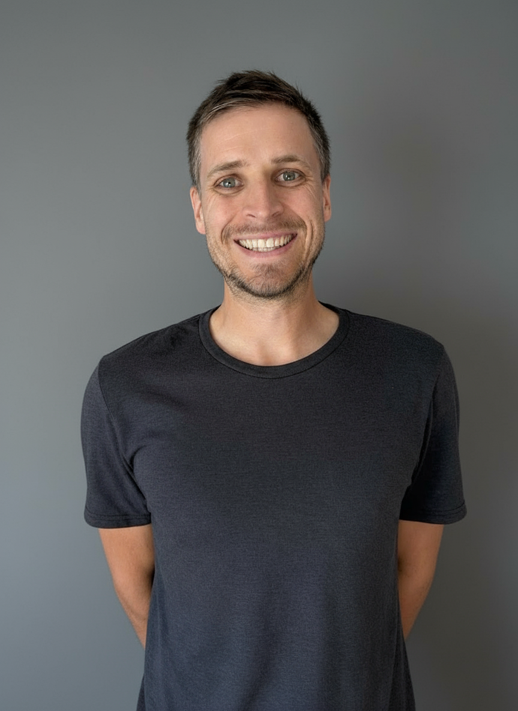

## Overview

Hello, I'm Sebastian, a fervent AI engineer and an accomplished manager. Beyond my technological acumen, I'm a global explorer, having spent two vibrant years as a digital nomad across 25 diverse nations. Four languages - English, Spanish, French, and German - are effortlessly part of my conversational repertoire, demonstrating my proficiency in thriving amidst diverse cultures. 

    




Despite my professional accomplishments, I believe in maintaining a balanced life. Thus, I devote time to yoga, swimming, hiking, cooking, reading, Pickleball and running. These activities keep me grounded and connect me to nature. 

## Employer Introduction

My name is Seb, and I'm a Lead AI Engineer from Germany with a Master's in Information Systems. After starting a Ph.D., I transitioned into consulting as a Chief Product Officer at a major Austrian bank. Later, I pursued NLP research with MIT, co-founded and exited a successful startup, and moved to the US to work as an AI/NLP engineer. Along the way, I've taught 20+ academic courses, and published 7 scientific articles honing my ability to communicate complex concepts—a key strength in bridging technical solutions with client or user needs. 

## Academic and Professional Vita

My journey began at Germany's distinguished [University of Bamberg](https://www.uni-bamberg.de/presse/pm/artikel/che-masterbefragung-2020/), where I studied Information Systems and bagged both a B.Sc and an M.Sc, graduating with honors. This experience ignited my interest in digital innovation that led to my fruitful two-year stint as a research assistant, collaborating with renowned professors to contribute to the latest research.

Working as the Chief Product Owner for consumer products at Raiffeisen Digital, Austria's leading bank, I had the opportunity to refine my leadership skills. Guiding various teams through complex projects, from [granting of loans](https://www.raiffeisen.at/ooe/de/privatkunden/kredit-leasing/konsumkredit.html), [opening of accounts](https://www.raiffeisen.at/ooe/de/privatkunden/konto/girokonto.html), to [qualifying for a credit card](https://www.raiffeisen.at/ooe/de/privatkunden/karte/kreditkarte.html) taught me to maneuver challenging professional scenarios. However, my thirst for knowledge was far from satisfied. 

In pursuit of further mastery in NLP, I took a sabbatical - a bold departure from the comfort of a well-settled managerial role. This led me back to academia, from being a visiting student at the esteemed [MIT's Center for Collective Intelligence](https://www.youtube.com/watch?v=myXANO-Mvo4) to my hands-on experience as an NLP Engineer at Narrativa. The journey was enriched by completing certification courses in [Machine Learning](https://www.datacamp.com/statement-of-accomplishment/track/fcc43394ed8ce4a8b20daf705e4c3e976c6e028e), [Deep Learning in NLP](https://www.coursera.org/account/accomplishments/certificate/2N9ZQ8BVSG8H), and [Entrepreneurship](https://www.startupschool.org/users/shWfuCCKk/certificate) at Y Combinator's Startup School.

Now, with over five years of valuable NLP experience, I have become a respected figure in the industry. I take pride in my contributions, particularly in developing and training deep neural networks for NLP tasks.

Presently, I am an integral part of the team at Cordial. Here, I have the opportunity to seamlessly bridge the gap between management and engineering using my unique blend of business acumen and technical expertise. My philosophy of coupling practical knowledge with groundbreaking innovation aims to revolutionize natural language processing. My unique multilingual and multicultural approach empowers me to propel forward in the NLP field, setting new standards in the realm of global technological leadership.

## My Personal Story: From Bavarian Cows to Seattle Skyscrapers

I grew up in a village of 300 people—though now it's nearly cow deserted— back then, we had more cows than people. Udderly unbelievable, right? The village was just 30 minutes from Würzburg in Bavaria, and hardly anyone went to university or pursued higher education.

Life there was safe and happy. I was immersed in German language and conservative culture—joining the local soccer club, helping at Catholic church services, performing at the local theater, and embracing the customs of our little area.

In Germany, once you reach the fourth grade of elementary school, it's time to decide which educational path to pursue. Like everyone in my family, I was expected to attend Realschule, the *middle tier* of Germany's school system. However, my teacher insisted that I should aim for the highest tier—the Gymnasium. He said I might not be the best, but he firmly believed I could make it. Thank you so much for believing in me—even if I didn't quite believe in myself.

So off I went to Gymnasium Marktbreit, where being bad at school was all the rage. Not paying attention, skipping homework, bullying, and being bullied—it was like "Cool Kids 101." I didn't like school much, and my grades weren't good at all. I guess I was just trying to fit in.

Then, a classmate switched to a school in Würzburg—the Deutschhaus Gymnasium—and told me it was so much better. "You can study Spanish and take advanced classes in sports if you make the switch," he said. Sounded like a win to me.

Fortunately, I made the switch. Our class at Deutschhaus was renowned for being the kindest and most ambitious. My girlfriend at the time taught me how to study and showed me that well-organized notes lead to great results. I became curious about life, and with the advanced sports classes, I learned how important it is to exercise to boost productivity, stay balanced and have fun.

Finally, we all took our A-levels (Abitur), and I earned a 2.2 (B), which was good and confirmed what my elementary teacher had predicted. Following the traditions of my village, I applied to become an apprentice at a bank — Raiffeisen — and landed the role. Everyone in my family was proud: my mom and dad, my sister. But my girlfriend said, "I'm happy for you, but you should really go to university."

All I could say was, "What's a university?" I mean, I thought I'd graduated from school forever and could finally stop memorizing stuff! But then this... So, thank you, Karoline, for pushing me into the deep end of academia.

I went to the University of Bamberg, and to support myself, I worked at a yogurt factory on the side—for a total of 5 years and 8 months. Yes, I became quite the connoisseur of fermented milk products! At some point, things with Karo faded, but my flatmate Tizian was applying for Erasmus—an exchange program. I had no idea what that was, but decided to try too. What's the worst that could happen? (Spoiler alert: It was amazing.)

Moving to Budapest, Hungary, and living with French and English speakers allowed me to express myself and have conversations beyond superficial topics in English—and a bit in French. Gosh, was I grateful. I met people from all over the world, studied more, and gained so much ambition. I even finished my bachelor's studies in 5.5 out of 7 semesters.

Right after, I applied for an internship in Hong Kong, where I gained international work experience and learned to travel. I visited ten different countries (Hong Kong, Macau, the Philippines, Taiwan, Vietnam, Thailand, Cambodia, Malaysia, China, and Japan) in six months—it was like speed dating but with passports! I returned home, completed my master's degree with distinction (1.2, A+), joined the United Nations in New York City, and started a Ph.D. with Tim Weitzel, one of the best professors in the world in Information Systems.

However, the academic world—with all its theoretical discussions and my confinement to small towns in southern Germany—made me quit and move to Vienna instead. I loved being back in an international city and made a career in finance. However, the daily haggling for resources tired me out, so I started coding full-time on the side. As one does.

It wasn't long before I made it into MIT as a graduate researcher at Peter Gloor's lab at the Sloan School of Management. I found myself researching the movement of plants (yes, plants do move!) and later the persuasiveness of messages. It was a fun time, leading to a few scholarships to chase my own startup dreams in persuasive message generation. But working remotely due to COVID-19 made us feel like we were all pulling in different directions—or maybe just pushing our Wi-Fi to the limits.

But during that time, I met Joy—my now wife. We traveled for 11 months and finally made it into the U.S. Here, we happily got married, I took a remote job for a kind and fun Californian tech startup, and adopted two kittens. 

It's all so non-linear—like a drunken snail trying to do calculus—and never what I expected. I can't believe it has happened to me. I'd like to come back and elaborate on this, but this is a brief summary of my life story as I sometimes share it with random people. Thank you, world, for being an awesome place.

Many regards from Seattle, Washington—about 5,000 miles (or 8,047 kilometers for my metric friends) from where I grew up,

Seb
