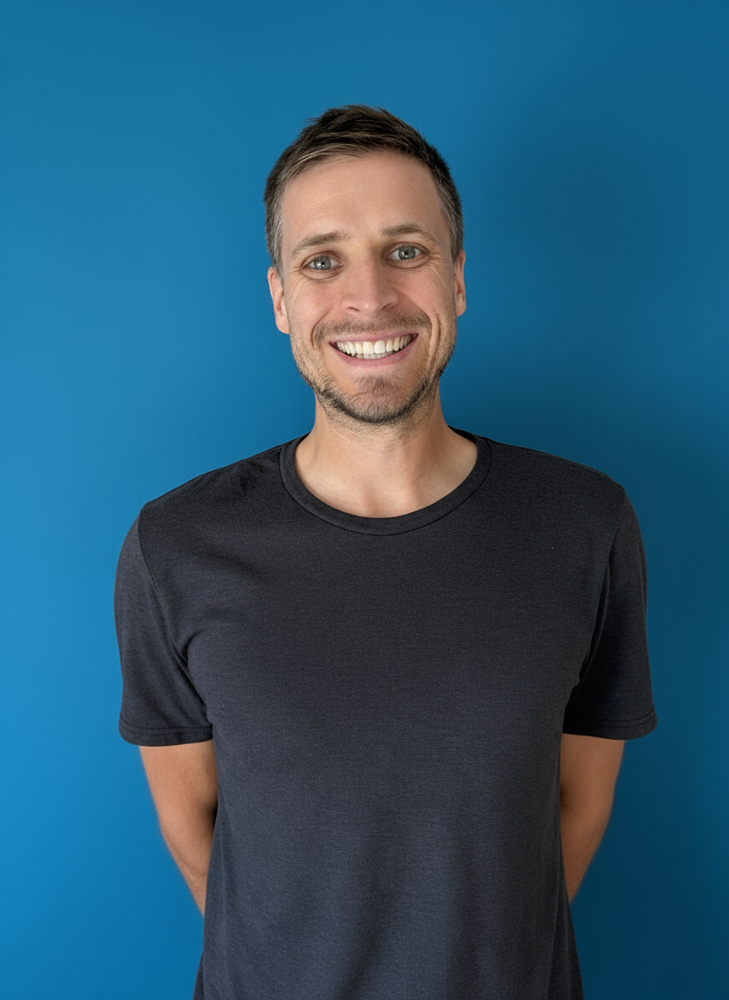

## Hi, I'm Seb

I'm an AI engineer who gets genuinely excited about language models and the wonderful things they can do. Originally from a tiny Bavarian village (more cows than people, seriously), I've somehow ended up in Seattle after a winding path through academia, banking, startups, and way too many airports.

    




When I'm not tinkering with NLP, you'll find me doing yoga, hiking, cooking elaborate meals nobody asked for, playing Pickleball, or going for runs. I speak German, English, Spanish, and enough French to order coffee and apologize for my French.

## The Professional Bits

I work as an AI engineer, mostly focused on NLP. My background is a bit of a zigzag: I studied Information Systems at the [University of Bamberg](https://www.uni-bamberg.de/presse/pm/artikel/che-masterbefragung-2020/), worked in product management at an Austrian bank (helping teams build things like [loan applications](https://www.raiffeisen.at/ooe/de/privatkunden/kredit-leasing/konsumkredit.html) and [account opening flows](https://www.raiffeisen.at/ooe/de/privatkunden/konto/girokonto.html)), then took a detour back into research.

That detour led me to [MIT's Center for Collective Intelligence](https://www.youtube.com/watch?v=myXANO-Mvo4), where I got to study some delightfully odd things, like how plants move and what makes messages persuasive. I picked up certifications in [Machine Learning](https://www.datacamp.com/statement-of-accomplishment/track/fcc43394ed8ce4a8b20daf705e4c3e976c6e028e), [Deep Learning](https://www.coursera.org/account/accomplishments/certificate/2N9ZQ8BVSG8H), and even did [Y Combinator's Startup School](https://www.startupschool.org/users/shWfuCCKk/certificate) along the way.

I've also taught a bunch of courses and written some academic papers—turns out explaining complex things to students is great practice for explaining complex things to, well, anyone.

## The Longer Story

I grew up in a village of 300 people, about 30 minutes from Würzburg. Nobody in my family had gone to university, and I wasn't exactly a star student. In fourth grade, my teacher suggested I try for Gymnasium (the academic track), even though I wasn't sure I belonged there. I'm still grateful he took that chance on me.

High school was... a journey. I started at one school where "cool" meant not caring about anything, then switched to Deutschhaus Gymnasium in Würzburg, where I finally found classmates who were both kind and curious. A girlfriend at the time taught me how to actually study. (Thanks, Karo.)

After graduation, I was all set to become a bank apprentice—a perfectly respectable path. But that same girlfriend asked, "Have you thought about university?" I genuinely didn't know what that meant. So off I went to Bamberg, working nights at a yogurt factory to pay the bills.

A flatmate convinced me to apply for an exchange program in Budapest, which opened up the world in ways I hadn't imagined. I met people from everywhere, finally felt comfortable speaking English, and caught the travel bug. An internship in Hong Kong followed, ten countries in six months. I finished my master's, briefly joined the UN in New York, started a PhD, realized academia wasn't for me, and pivoted to Vienna to work in finance.

Finance taught me a lot, but I kept coding on the side. Eventually, that led to MIT, then a startup, then—during COVID—meeting my wife Joy. We traveled for nearly a year before settling in Seattle, where we got married and adopted two cats who now run the household.

It's been a wonderfully non-linear path. I never could have planned any of it.

Many regards from Seattle,

Seb
