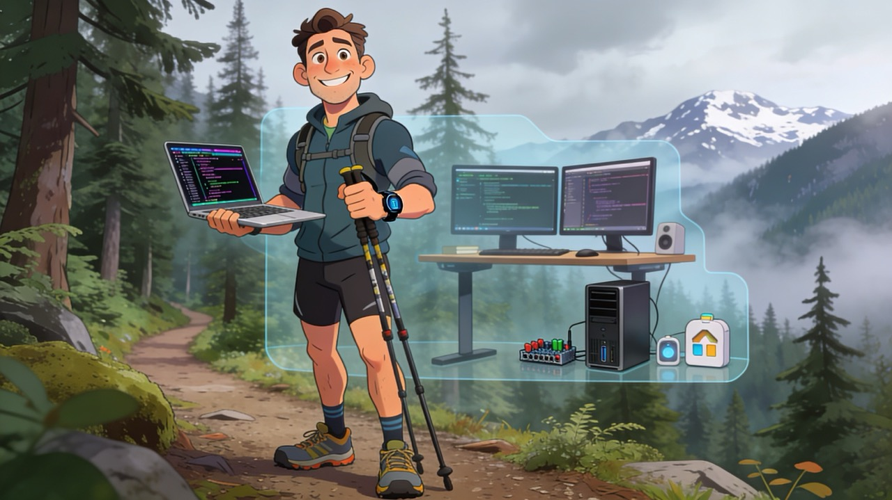

## Hi, I'm Seb

I'm an AI engineer at **Cerebras**, where I help turn extremely fast AI inference into things developers can actually use.

I am also a trail runner with an unreasonable annual mileage target, a newly licensed drone pilot, a frequent traveler, Joy's husband, and a member of a household managed by two cats.

Originally, I come from a tiny Bavarian village with more cows than people. Somehow, a winding path through banking, academia, startups, and way too many airports brought me to Issaquah, Washington, at the edge of the Cascade Mountains.

    




## My Current Operating System

**At work:** I build AI products, integrations, and examples at Cerebras. Much of my work lives at the boundary between models and product engineering: making fast inference useful inside the frameworks, tools, and workflows developers already rely on.

**Outside:** I run trails and mountains, often far enough that it stops sounding sensible. Running clears my head, keeps my work sustainable, and gives me an excuse to explore the Pacific Northwest one switchback at a time.

**From the air:** I fly a small drone and am slowly learning to see familiar landscapes from a completely different perspective. It is technical enough to be interesting and visual enough not to feel like more work.

**At home:** Life with Joy and our cats, Simba and Sasha, is the center of everything. The rest can be intense. Home is warm, funny, and wonderfully ordinary.

I speak German, English, Spanish, and enough French to order coffee and apologize for my French.

## The Professional Bits

At Cerebras, I work on the connective tissue around AI inference: production-oriented cookbooks, open-source provider integrations, and the practical engineering required to make models useful beyond a benchmark. That has included work across ecosystems such as LangChain, Pydantic AI, Flowise, Dify, and AI coding tools. The common question is simple: now that inference is this fast, what becomes possible?

My background is a bit of a zigzag. I studied Information Systems at the [University of Bamberg](https://www.uni-bamberg.de/presse/pm/artikel/che-masterbefragung-2020/), worked in product management at an Austrian bank, and helped teams build products such as [loan applications](https://www.raiffeisen.at/ooe/de/privatkunden/kredit-leasing/konsumkredit.html) and [account opening flows](https://www.raiffeisen.at/ooe/de/privatkunden/konto/girokonto.html). Then I took a detour back into research.

That detour led me to [MIT's Center for Collective Intelligence](https://www.youtube.com/watch?v=myXANO-Mvo4), where I got to study some delightfully odd things, like how plants move and what makes messages persuasive. I picked up certifications in [Machine Learning](https://www.datacamp.com/statement-of-accomplishment/track/fcc43394ed8ce4a8b20daf705e4c3e976c6e028e), [Deep Learning](https://www.coursera.org/account/accomplishments/certificate/2N9ZQ8BVSG8H), and even did [Y Combinator's Startup School](https://www.startupschool.org/users/shWfuCCKk/certificate) along the way.

From there, I founded AI products, worked on enterprise retrieval systems, shipped AI features used at large scale, and learned that I am happiest close to difficult technical problems with visible product impact.

I've also taught many university courses and written academic papers. It turns out that explaining complex things to students is excellent practice for explaining complex things to engineers, users, and occasionally myself.

## The Longer Story

I grew up in a village of 300 people, about 30 minutes from Würzburg. Nobody in my family had gone to university, and I wasn't exactly a star student. In fourth grade, my teacher suggested I try for Gymnasium (the academic track), even though I wasn't sure I belonged there. I'm still grateful he took that chance on me.

High school was... a journey. I started at one school where "cool" meant not caring about anything, then switched to Deutschhaus Gymnasium in Würzburg, where I finally found classmates who were both kind and curious. A girlfriend at the time taught me how to actually study. (Thanks, Karo.)

After graduation, I was all set to become a bank apprentice, a perfectly respectable path. But that same girlfriend asked, "Have you thought about university?" I genuinely didn't know what that meant. So off I went to Bamberg, working nights at a yogurt factory to pay the bills.

A flatmate convinced me to apply for an exchange program in Budapest, which opened up the world in ways I hadn't imagined. I met people from everywhere, finally felt comfortable speaking English, and caught the travel bug. An internship in Hong Kong followed, ten countries in six months. I finished my master's, briefly joined the UN in New York, started a PhD, realized academia wasn't for me, and pivoted to Vienna to work in finance.

Finance taught me a lot, but I kept coding on the side. Eventually, that led to MIT, founding a startup, building AI products for other companies, and joining Cerebras.

During COVID, I met my wife Joy. We traveled for nearly a year before settling in Washington, where we got married and adopted two cats who now run the household.

It's been a wonderfully non-linear path. I never could have planned any of it.

These days, I spend my time trying to make AI systems faster and more useful, running through mountains, occasionally looking at those mountains through a drone camera, and building a good life with Joy.

Many regards from the Pacific Northwest,

Seb
