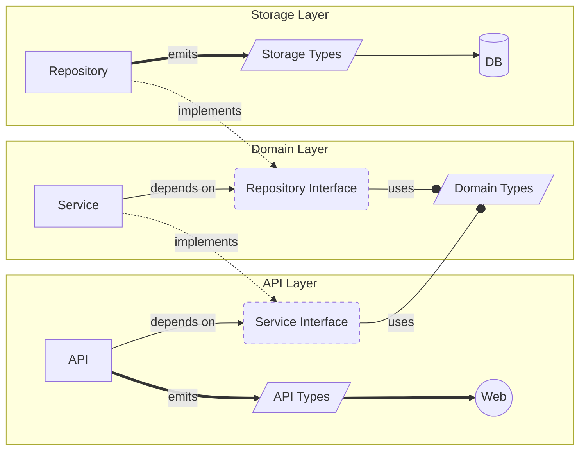
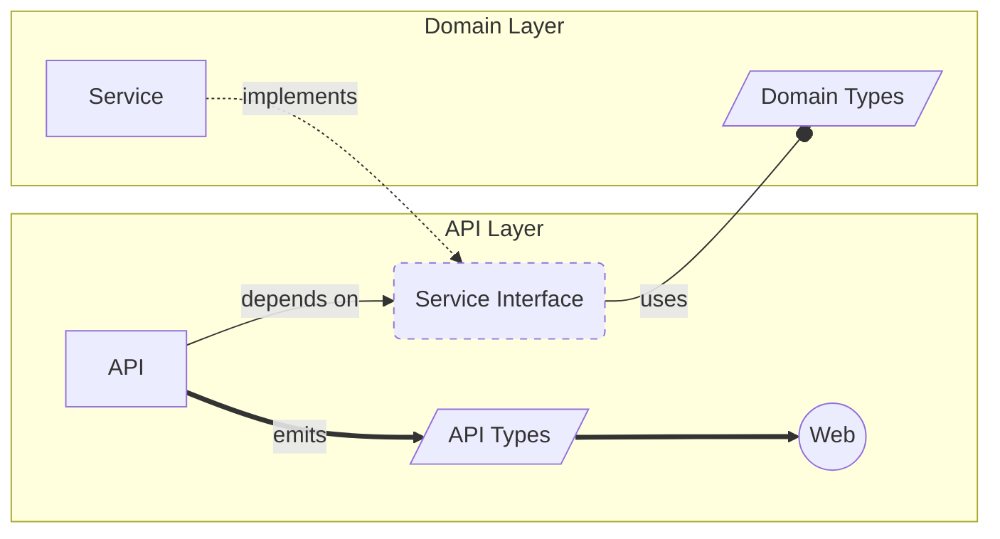
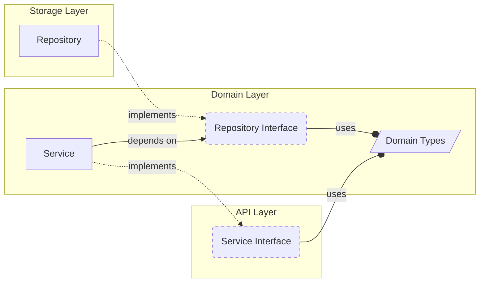
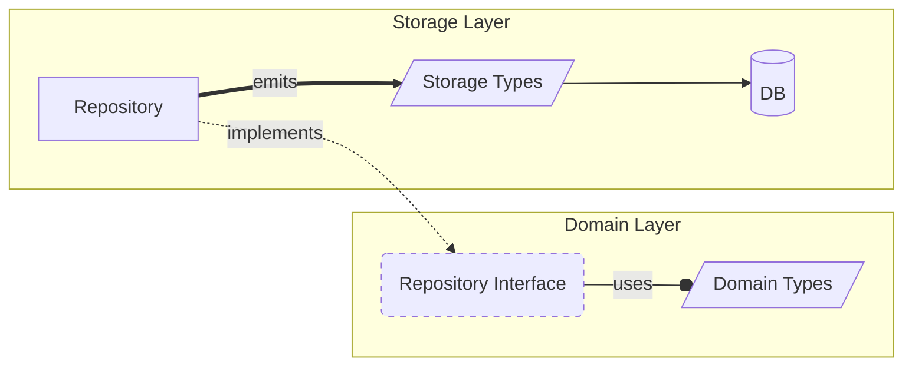

## Architectural Design - Walk to Tennis Courts on Snoqualmie Ridge

- `Hole in Trees`: repository layer: storage types => database
- `Forest Path`: service layer: repo interface => domain types
- `Traffic Lights`: api layer: service interface => api types => web

- `Thai Eatery`: Main: deps defined in interface, instantiated by main, passed as fields
- `Swimming Pool`: API: serialization, authN, logging/tracing
- `Baby School`: Domain: ubiquitous clean language, authZ, never reach out.
- `Tennis Courts in Snoq. Park`: Persistence: domain types != persistence types.


### Layer Model

This software is organized into 3 distinct layers: API Layer, Domain/Service Layer, and Persistence Layer.
This is not a one-size fits all model and adjustments might need to be made for various edge cases,
but in general this is a good starting point which will make it harder to build the wrong abstractions.

This model does not specify any kind of physical organization, like a folder hierarchy.
It is not expected that there is a `api`, `domain`, and `storage` package that contain all types for each layer.
Rather, this design defines *logical* layers; i.e., layer model is about establishing boundaries by separating distinct concepts.

#### 3-Layer Model Visual Overview



Notes:
- Each layer depends on an Interface that it defines itself.
- The Repository Interface is implemented in the Storage Layer
- The Service Interface is implemented in the Domain Layer
- Since each Interface uses Domain Types (i.e. "Ubiquitous Language") in their functions, each implementation also must use Domain Types. This keeps the Domain model pure. 
- The Storage layer emits Storage Types to its DB
- The API Layer emits API Types to the Web

#### A note about folders/packages

In Go, a package corresponds to a folder. However, developers often create a project by first creating a
folder structure that loosely outlines some design philosophy like DDD or BDD, etc...; Ending up with folders (packages)
with names like `models`, `controllers`, `views` , `domain`; This is discouraged in Go. Instead, we organize packages into 
shared responsibility: ie -- what do all these types/functions *DO*; and then we name the package after that functionality.

From [JBD's Package Style Guide](https://rakyll.org/style-packages/):

> A common practise from other languages is to organize types together in a package called models or types. In Go, we organize code by their functional responsibilities.
>
> ```go
> package models // DON'T DO IT!!!
>
> // User represents a user in the system.
> type User struct {...}
> ```
>
> Rather than creating a models package and declare all entity types there, a User type should live in a service-layer package.
>
> ```go
> package mngtservice
>
> // User represents a user in the system.
> type User struct {...}
>
> func UsersByQuery(ctx context.Context, q *Query) ([]*User, *Iterator, error)
>
> func UserIDByEmail(ctx context.Context, email string) (int64, error)
> ```

### Entrypoint Layer / (main)

package `main` is the entry point for the program in Go. This is where your application configuration
startup, and dependency injection happens. You may choose to factor out command-line parsing and dependency wiring into
one or more other packages -- we can collectively call these packages the "Entrypoint Layer"

Go does not have DI like Java does, in the sense that another package can implicitly wire their dependencies up to some 
global registry like Spring Boot. Instead, Go tends to be more explicit: Dependencies are parameters to function, or fields within a struct.

In short, Dependency Injection in Go:
- Your layers ask for dependencies by defining and interface for the thing they want.
- Entrypoint instantiates an implementation from a different package
- Entrypoint passes the concrete implementation to the layer as a parameter/struct field.

### API Layer

The API layer is your surface to consumers of your application. This is HTTP, REST, GRPC, GraphQL, etc...
In this layer you generally do the following.

  - Serialize data types from Domain to API types (defined in Open API Schema)
  - Perform Authentication (AuthN - Who are they?)
  - Tracing and request logging
  - Define `Service` interface using Business types implemented by the Domain/Service layer

Domain types should never be served directly to API Consumers. By using API Types (often generated from Open API Specs)
you can evolve your API and create new ones without requiring (often breaking) changes to your Domain model.


  
### Domain / Service Layer

The domain layer is where your application logic goes; ie the "real" application is written here.
The services defined here implement the `Service` interfaces in the API.

You should strive to use clean structs defined in the package, and avoid persistence primitives here.
Types defined here can be thought of the "Ubiquitous Language" found in Domain Driven Design.

> Do not reach out to API or Persistence layers: **they should reach in**

Authorization (AuthZ - What can they do) is commonly part of the business logic, 
so checking authorization here or filtering results by their access is often appropriate here.

Don't call directly to your Persistence layer methods, instead you define an interface (typically named `<Something>Repository>`).
This interface defines operations you expect your persistence layer to make on the given Domain types. Your peristence
layer creates a type that implements this interface.



### Data / SQL / Persistence layer

This layer implements the `Repository` interfaces defined in the Domain / Service Layer. This translates
the domain types into their appropriate persistence types and performs operations on the storage.

This layer may have its own types for serialization to storage; it should not store the Domain types directly.
By separating Domain and Persistence types, you can evolve your persistence independently of your business logic.

